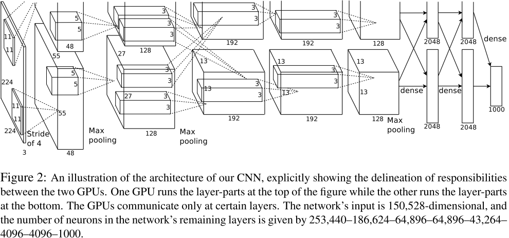
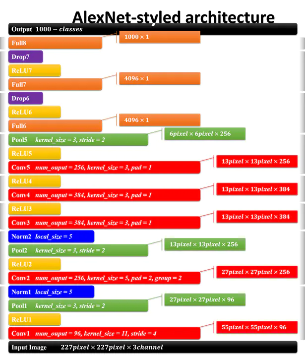
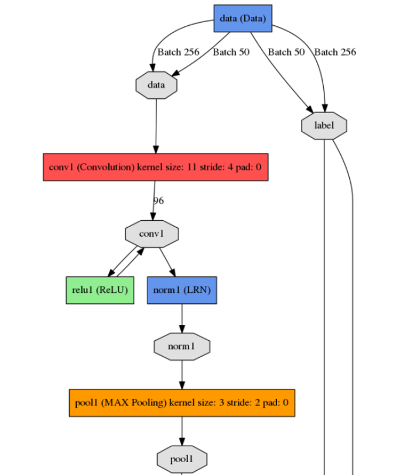

# AlexNet

- 词短句翻译

	the previous state-of-the-art：之前最先进的方法

	non-saturating neurons：非饱和神经元
	
	immense complexity：巨大复杂性
	
	high-resolution：高分辨率
	
	respectively：分别地
	
	depict：描述、描绘

## Abstract

关键词一：

n**on-saturating neurons（非饱和神经元）**，与之对应的就是saturating neurons（饱和神经元），此两者概念往往与non-linear activation（非线性激活函数）有所联系，其含义区别在于：

**非饱和神经元：**没有被挤压（到一个特定的区间）处理过的值，即对输入值进行处理后，不会将输出限定在某一范围内，比如ReLU和LeakyReLU的激活函数神经元

- **ReLu:** Input Neurons的值，要么变0，要么保持原值（无挤压，无最大最小值限制）
- **LeakyReLU:** Input Neuronns，要么按照某比例缩小，要么保持原值（无挤压，无最大最小值限制）

**饱和神经元：**被挤压（到一个特定的区间）过的值，对输入值处理后，会得到被限定在一定范围内的量值，比如sigmoid和tanh的激活函数神经元，

- **sigmoid:** Input Neurons的值会被挤压到[0,1]的区间
- **tanh：**Input Neurons的值会被挤压到[-1,1]的区间

神经网络中使用能够形成non-saturating neurons的非线性激活函数的好处：

- 避免梯度消失（vanishing of gradients）或梯度爆炸（exploding of gradients）

关键词二：

**Dropout**，

## Introduction

过往的数据集较小，深度网络在小数据集中训练得到了很好的结果，现在，数据集在可得到的情况下，有了极大的补充，愈发的庞大，急需一个新型网络从海量数据中训练出模型，识别出大数据中的各类物体，CNN系列网络在之前的发展过程中已经被证明了拥有诸多优秀特性：

- CNN系列网络的能力能通过网络的深度和宽度进行调整提高，
- 他们能很好的训练把握图片的性质（譬如统计的平稳性和像素依存性的局部性）

因而相较于其他前向神经网络，CNN系列能够以更少的神经元参数，层数，连结训练得到仅仅比最好性能略差的结果，相较于所得和所弃，完全是很好的选择。

而当前更先进的GPU和更大的数据集能够支持训练出更加庞大优秀的CNN网络。

故而本篇论文作者团队做出的努力，如下：

- 训练了极大的卷积网络，同时在ILSVRC-2010和ILSVRC-2012竞赛中使用的训练集测试集（是ImageNet的子集）上得到了远超以往最好结果的结果。
- 高度优化了GPU对2D卷积运算以及GPU对卷积训练中所用的其他运算的支持，优化结果公开可见。
- 新网络中拥有更多新的特性，细节可见论文第三部分
- 但新网络由于整体结构过于庞大容易出现overfitting的现象，在文章第四部分中提及如何避免（即dropout操作）

新网络有五层卷积层和三层全连接层，每一卷积层中的参数量都少于总模型中参数量的1%，通过测验发现，网络的深度极为重要，若是移除任一卷积层。

就实验结果而言，新网络的大小和能力依然受限于GPU能力。

## 数据集

使用ImageNet的子集——ILSVRC的数据集验证性能，利用top-1和top-5描述错误率，top-5错误率指的是对于测试图片，其真正标签不在模型认为的其最有可能的五种标签中的比例（fraction，原意为分数）。

## 网络结构

上图较难以理解，😂，咱们换一个

这张图从下往上看，num_output表示卷积核数量（也就是卷积后，feature map数量，或者将所有feature map视为一个大tensor，则也可以认为是tensor的channel），kernel_size表示卷积核大小，stride表示步长，pad表示扩充边缘的像素数，以下网络各参数讨论皆以此图为准。

据论文中的图例描述，AlexNet分为上下两个部分网络，分别对应两块GPU提高运算速度，且只到特定网络层才需要两块GPU进行交互，利用两块GPU提高运算效率。理解网络的时候暂不用关注。

网络一共八层，五层卷积层，三层全连接层，

> 第一层：
>
> 首先：
>
> Conv1，输入图片227 * 227 * 3图像，卷积核数量num_output = 96，卷积核大小kernel_size = 11 * 11 * 3，卷积核移动步长stride = 4，pad = 0（默认，即不扩充边缘）
>
> 卷积后图片大小
>
> wide = （original_wide + 2 * pad - kernal_size）/ stride + 1；
>
> height = (original_height + 2 * pad - kernel_size) / stride + 1；
>
> channel = num_output；
>
> 因此，第一层卷积输出为 55 * 55 * 96；
>
> 之后：
>
> 会将Conv1得到的feature map通过ReLU非饱和非线性激活函数，变化矩阵中的值，形成非线性变化。
>
> 然后：
>
> LRN（Local Response Normalization，局部响应归一化）由于使用了ReLU作为激活函数，值域不被限定，需要对激活函数结果进行归一化，
>
> 最后：
>
> Pool（池化），kernel_size = 3 * 3 * 96，stride = 2，pad = 0；
>
> 最终输出：
>
> 27 * 27 * 96

**需要注意的是：**图中的normal并不是normalization的意思，noemalization是在Pool之前，经过ReLU激活函数之后，实际可视为：

### 网络中有趣的特性

#### ReLu激活函数

一般网络中使用tanh或sigmoid（饱和非线性函数）作为激活函数，但在训练中他们梯度下降的速率远逊色于非饱和非线性函数，譬如$f(x) = max(0, x)$ ，因此开始考虑新的激活函数——ReLU，通过实验，ReLU函数的学习速率确实快于饱和非线性函数

故此，在新网络中尝试使用ReLU函数，同时尽力去解决overfitting的问题。

#### 多GPU训练

这一点，姑且先不投入过多精力，大意是在特定层，进行多GPU计算，即有些卷积层两块卡没有全部连接，所以参数计算的时候注意下就行，利用多GPU的基础下搭建更加庞大的网络。🤓

#### 局部响应归一化

LRN（Local Response Normalization），其作用是对局部神经元的活动创建竞争机制，使得其中响应比较大的值变得相对更大，并抑制其他反馈较小的神经元，增强了模型的泛化能力，模仿生物上的一个叫侧抑制概念。一般我们如果要抑制某个神经元周围的神经元，可以直接最大池化。但是这个侧抑制是在通道维度上进行抑制。

ReLU激活函数不会将输入处理为一定范围内，只要一些正样本对神经元产生效果，那么ReLU就会学习到对应的特性，不会产生饱和情况，但局部归一化能够协助模型，使得他更加具有泛化能力，归一化公式如下：

$b_{(x,y)}^i = \frac{a_{(x,y)}^i}{(k+\alpha\sum_{j=max(0,i-\frac{n}{2})}^{min(N-1,i+\frac{n}{2})}(a_{(x,y)}^j)^2\beta}$

$a_{(x, y)}^i$代表的是ReLU在第i个kernel的(x, y)位置的输出，n表示的是b$a_{(x, y)}^i$在通道维邻居个数，N表示该kernel的总数量。表示$b_{(x, y)}^i$的是LRN的结果

从公式可以看出 其实就是在通道维度上取个半径r=n/2 对于通道上的任一点取他半径内的点进行平方累加（这里取值注意不要超过边界）。抑制也是对通道上半径r内的神经元进行抑制。如果将每一个特征图当做学到的一种特征，不同的特征图学到的是不同的特征，那么不同的通道上相同位置神经元应该也学到不同的信息才行，所以进行这个局部归一化的理由貌似也说的通，使得其中响应比较大的值变得相对更大，响应比较小的值相对更小。

尴尬的是，这一方法后来被有些学者认为意义不大🤣。

#### 覆盖池化

Overlapping Pooling，传统的池化操作不会有重叠现象地产生，往往池化卷积核的大小与步长相等，即pooling_size == stride，而AlexNet中则是让pooling_size > stride，形成的效果类似卷积的过程，能够降低error rate，同时避免过拟合（论文中的描述）

## Reducing Overfitting

AlexNet有近60万的参数量，需要考虑过拟合的风险。

### 数据增强

**Data Augmentation**，我认为这就是一种数据增强方式，通过少量的计算从原始图片变换得到新的训练数据。

第一种是随机裁剪，原图256×256，裁剪大小为224×224，由于随机，所以每个epoch中对同一张图片进行了不同的裁剪，理论上相当于扩大数据集32×32×2=2048倍！32是256-224；2是由于水平翻转。
在预测（deploy）阶段,不是随机裁剪，而是固定为图片四个边角，外加中心位置。翻转后进行同样操作，共产生10个patch。

第二种更改训练图像中RGB通道的强度，对RGB通道使用了PCA（主成分分析），对每个训练图片的每个像素，提取出RGB三个通道的特征向量与特征值，对每个特征值乘以一个α，α是一个均值0.1方差服从高斯分布的随机变量。

### Dropout

结合多个训练模型可以减少测试误差，但是在神经网络中，训练每个模型都需要大量的时间，代价昂贵。Dropout通过在隐藏层中以rate概率随机将部分神经元输出设置为0，这些神经元既不参于前向传播，也不参与反向传播。所以每次提出一个输入，该神经网络就尝试一个不同的结构，但是所有这些结构之间共享权重。因为神经元不能依赖于其他特定神经元而存在，所以这种技术降低了神经元复杂的互适应关系。在测试时，使用所有的神经元，但将它们的输出乘以rate。

## Details of Learning

1. 使用随机梯度下降（SGD）法，batch size是128个examples，momentum设为0.9，weight decay设为0.0005。
2. 使用N(0, 0.01)的高斯分布初始化权重w，第二、四、五个卷积层和全连接的所有隐藏层的偏置（bias）初始化为1，其余层的bias初始化为零。这样的初始化能够加速学习的速度，并给ReLU提供正的输入。
3. 学习率在每一层都相同，采用启发式策略手动调整：初始化为0.01，并且在每次结果不再改变时减小10倍，三次之后终止。 这样的训练方式用NVIDIA GTX 580 3GB GPUs对120万图像训练90个周期需要五到六天。

## Result

这里可以放出在数据集上的参数表现，和其他同类网络在同一数据集上的表现差异……，可视为定量评估

### Qualitative Evaluations

定性评估，此网络在两块GPU上进行训练，因此，它可以呈现出两块GPU在工作时专注方向的不同，

主要讨论的网络整体学习的是什么，怎样学习的。

## Discussion

a ba a ba……，解决了啥，网络有啥要注意的，小缺点？，未来发展。

