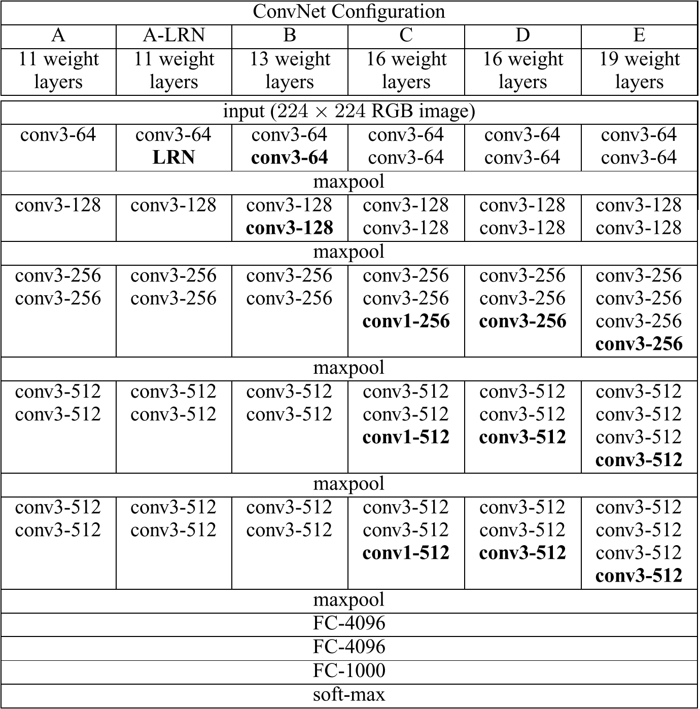
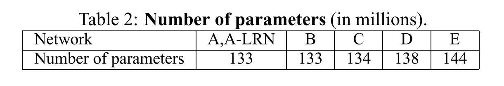

# VERY DEEP CONVOLUTIONAL NETWORKS FOR LARGE-SCALE IMAGE RECOGNITION

[toc]

- 词短句翻译

  investigate：调查，研究

  thorough：彻底的，完全的

  prior-art：先前技术

  localization：本地化，定位

  secure：获得

  generalize：推广，泛化

  facilitate：促进

  cluster：簇，集群

  utilis：利用

  to this end：为了这个目的

  assess：评估评价

  evaluate：评估评价

  revision：修订
  
  utilize：利用
  
  resolution：分辨率，解决
  
  topology：拓扑学
  
  conjecture：推想，推测
  
  converge：收敛，推理
  
  stall：阻碍
  
  circumvent：避免
  
  initialise：初始化
  
  augment：扩大
  
  underwent：经过
  
  shift：变换
  
  jitter：抖动
  
  isotropically：各自相同的，（长宽等比放缩）
  
  Namely：也就是说，即
  
  substantially：极大地

## ABSTRACT

卷积神经网络深度和它在大规模图像识别上的准确度之间的联系。

主要贡献：对使用了很小卷积核的网络结构，彻底清晰地分析评测了增加其深度的带来的影响，而结果显示当网络深度提升至16-19层时，先前网络能有极大的提升。这些发现是我们在Image Challenge 2014的提交上的基础，我们也分别获得了定位方面一等奖和分类方面二等奖（These findings were the basis of our ImageNet Challenge 2014 submission, where **our team secured the first and the second places in the localisation and classification tracks respectively**）我们也证明了我们的方法能够很好的推广到其他数据集，并实现了最先进优异的结果。我们已经公开了两个表现最好的的卷积网络模型，以促进在计算机视觉中使用深度学习的进一步研究。

## 1 INTRODUCTION

卷积神经网络在大规模的图片、影像的识别上取得了较大的成功，它的成功基于大型公共图片数据集库，比如ImageNet，以及高性能计算机系统，譬如GPU和大规模分布式集群。此外，ImageNet Large-Scale Visual Recognition Challenge在深度视觉识别体系结构的发展中发挥了重要作用，它已经成为了几代大规模图像分类系统的测试平台，从高维浅层特征编码到深层卷积网络。

随着卷积神经网络在计算机视觉领域愈加的普遍，大家做了很多关于如何提高最初的结构的准确率的尝试。举例而言（for instance），ILSVRC 2013中最佳的提交方案在网络的第一层使用了较小的接收窗口（卷积核？）和更小的步长，以及在整个图片和多个维度上对网络进行密集地训练测试。

本文中，我们指出了影响卷积网络的另一个重要因素：网络的深度。为此，我们固定了网络结构的其他参数，仅仅逐步的通过增加卷积层的方式，增加网络的深度，在所有层都是用了$3 \times 3$卷积核的条件下，这样的操作是可行的。

最后，我们提出了一个更加准确的卷积神经网络结构，不仅能在ILSVRC分类和定位任务上取得最先进的准确率，而且能够应用于其他图片识别数据集，即使该网络结构仅仅作为相对简单流程的一部分，也能够有较好的提升效果。我们已经发布了两个性能最好的模型，以供进一步的研究。

接下来的文章将以如下结构安排。

Section 2，我们会描述我们的卷积网络的配置

Section 3，图片分类网络训练和评测的细节

Section 4，在ILSVRC分类任务上对配置进行比较

Section 5，paper concludes

为了完整性，我们在附录A中描述并评估了我们的ILSVRC-2014目标定位检测系统，在附录B中则讨论了如何在其他数据集中进行深层网络特征的泛化推广，附录C主要是论文修改的列表

## 2 CONVNET CONFIGURATIONS

为在一个公平环境下验证深度增加带来的提升效果， 我们的卷积网络层用相同的原则进行设计，在这一部分我们先描述我们网络的通用层（Section. 2.1），然后详细描述评价过程中的特殊配置（Section. 2.2），我们设计选则在Section. 2.3中进行讨论同时与以往的工作进行比较。

### 2.1 ARCHITECTURE

训练过程中，我们网络的输入是固定大小的$224\times224$的RGB图片。我们唯一做的预处理就是从每个像素中减去训练集中计算得到的平均RGB的值。

图片经过一系列堆叠卷积层，卷积层中使用小视野的$3\times3$卷积核（他是捕捉左/右、上/下、中间特征的最小大小的卷积核）。在某一个配置中我们也使用了$1\times1$卷积核，可以将其视为输入通道的线性变换(在他之后再进行非线性)。

卷积的步长设置为$1$像素

卷积层对输入图片进行空间填充，使得卷积后结果与输入空间分辨率相同，对于$3\times3$卷积层，$padding = 1$

池化过程由五个最大池化层进行，部分卷积层后会有池化层。最大池化层由$2\times2$池化窗口（卷积核，滤波器），步长为$2$

堆叠的卷积层网络（不同的结构有不同的深度）结构如下：

- 三个全连接层（is followed by three Fully-Connected (FC) layers）：

  第一层和第二层：有$4096$个通道数

  第三层：$1000$个通道用于ILSVRC的$1000$类的分类任务

- 最后一层，$softmax$层

所有网络的全连接层结构都相同。

所有的隐藏层都是用激励函数（ReLU），变为非线性。

我们需要说明我们的网络结构，除一个外，都没有包含局部性应归一化。正如Section 4展示的结果那样， 归一化对网络在ILSVRC数据集上的表现并没有提升效果，只会导致内存空间的损耗和计算时间的耗费。关于使用$LRN$层的参数设置如（Krizhevsky et al., 2012）

### 2.2 CONFIGURATIONS

卷积层配置如下：

接下来，我们会使用图中的$A-E$称呼各个网络。所有网络的配置都遵循Section. 2.1中介绍的通用设计，唯有深度，每个网络不同，从$A$的$11$层权值层（$8$个卷积层和$3$个全连接层）到$E$中的$19$个权值层（$16$个卷积层和$3$个全连接层）。卷积层的宽度（卷积层的通道数很小）很小，从第一层的$64$个通道经过每一次最大池化后变大两倍最后到达$512$。

下表中，我们展示了每个配置的参数量

虽然网的深度很大，但我们的深度网中权值（参数）的数量并不比卷积层更大感受野更大的的浅层网中权值的数量更大。

### 2.3 DISCUSSION

我们的卷积神经网络与ILSVRC-20212和ILSVRC-2013比赛中表现最好的网络结构上有很大的差异。相比于在第一卷积层中使用相对比较大的感受野（卷积核$11\times11$，步长为$4$，或是卷积核$7\times7$，步长为$2$），我们整体网络都使用了较小的$3\times3$感受野（卷积核），步长为$1$实现了与输入进行每一个像素的卷积。

可以看出两层$3\times3$卷积层的堆叠（不含空间池化过程）能实现相当于$5\times5$的感受野，三层$3\times3$卷积可以拥有$7\times7$的感受野。那么$3\times3$卷积的堆叠和单一的$7\times7$卷积的区别在哪里呢？

- 用三个非线性修正层代替单一非线性修正层，能够让决策函数有更强的鉴别能力

- 减少了参数数量

  假设输入和三层$3\times3$卷积层堆叠的输出都为$C$个通道数时，堆叠方式的参数量为$3(3^2C^2)=27C^2$，而单一$7\times7$的卷积层则有$7^2C^2=49C^2$个参数，将近减少81
  %左右的数量。

  这可以看作是对$7\times7$普通滤波器进行正则化，迫使它们通过$3×3$滤波器进行分解(在两者之间注入非线性)。

而$C$网络中的$1×1$卷积层则是一种增加决策函数非线性特性而不影响卷积层感受野的方法。尽管在我们的例子中$1\times1$卷积的本质是对同一维空间的线性投影（输入和输出的通道数相同），但是向整流函数（激活函数）引入了额外的非线性。重点可以注意“Network in network”中对于$1\times1$卷积的应用。

与其他工作的一些比较：

- 小型卷积核最早被用于“high performance convolutional neural networks for image classification”，但他们的网络中明显深度不如我们，同时他们并没有在大规模的ILSVRC数据集上进行评测。
- “Multi-digit number recognition from street view imagery using deep convolutional neural networks”在街景数字的识别任务中使用了深度卷积网络（$11$层权重层），其结果显示出深度的增长确实引起了更好的表现结果。
- “Going deeper with convolutions”中的GoogleNet作为ILSVRC-2014中表现最好的网络，虽然与我们的工作是相互独立的，但是却有着共同点，都是基于非常深层的卷积网络（$22$权重层）和小型的卷积核（除了$3\times3$大小的卷积核，还有$1\times1$和$5\times5$）。然鹅，他们的网络拓扑结构远比我们的复杂，同时为了减少计算量，第一层特征图的空间分辨率减少的更加多，更加激进。

如Section 4.5中所呈现的一样，我们的模型在单网络分类精度上远好于“Going deeper with convolutions”的网络

## 3 CLASSIFICATION FRAMEWORK

前一章节中，我们展示了我们网络的配置细节。本章节我们将详细描述分类网络的训练和评价过程细节。

### 3.1 TRAINING

卷积网络的训练过程基本按照“ImageNet classification with deep convolutional neural networks”提及的流程进行（除了从多尺度训练图片中采样取得输入图片的过程，具体将在后面阐述），也就是说训练通过基于后向传播的小批量动量梯度下降优化多项logistic回归（逻辑斯蒂回归）。

- 批大小设置为256

- 动量设置为0.9

- 训练通过权重衰减（$L_2$惩罚系数设置为$5\cdot10^{-4}$）和前两层全连接层的`dropout`正则化（`dropout`的比率为$0.5$）进行正则化（这里的翻译有点问题，姑且先看着，The training was regularised by weight decay (the $L_2$ penalty multiplier set to $5\cdot10^{-4}$) and `dropout `regularisation for the first two fully-connected layers (`dropout `ratio set to $0.5$).）

- 学习率初始化为$10^{-2}$，然后当验证集的准确率停止提高的时候再降低10倍

  总的来说学习率一共衰减了3次，大约在$370k$次迭代（$74\ epochs$）后停止

尽管我们的参数数量和网络深度远大于“ImageNet classification with deep convolutional neural networks”中的网络，但是我们的网络仅需要更少的$epochs$，来让网络达到收敛结果，我们推测这是因为如下两个原因：

1. 更大的深度和更小的卷积隐含的生成了一些规则
2. 预先对某一些层进行了初始化

网络权重的初始化工作非常的重要，不合适的初始化会导致深度网络中的不稳定而影响网络的学习结果，为了避免这样的问题，我们首先在$Table\ 1$中选择了相对比较浅层的$A$网络进行随机初始化的训练，然后训练深层深层网络结构时，我们按照$A$网络结果初始化网络前四个卷积层和后三个全连接层（中间层的参数是随机的）。我们没有降低预初始化层的学习率，允许它们在学习过程中改变。对于某些应用到随机初始化的权重，我们从均值为$0$、方差为$10^{−2}$的正态分布中抽样对权重进行设置。$biases$（基）初始为0。值得注意的是，在论文提交后，我们根据“Understanding the difficulty of training deep feedforward neural networks”发现可以使用随机初始化过程，而不需要预先训练就初始化权重。

同时为了获得固定尺寸$224\times224$的图片输入到卷积网络中，通常将训练图片调整大小后经过随机切割获得输入图片（每次$SGD$迭代时每张图片进行裁剪一次裁剪）。为了进一步扩大训练集，裁剪得到的图片会经过记忆不得随机说IP ing翻转和随机$RGB$色彩值的变换。

对于训练图片大小调整过程如下：

**Training image size**，

- $S$，训练图片等比调整后的最小边，卷积网络的输入将在它的基础上进行裁剪，我们也称他为训练尺度。当裁剪尺度为$224\times224$的时候，原则上，$S$可以是任意的不小于$224$的值，当$S=224$的时候，裁剪的时候将会获得将近全图的统计信息，最小边将完全被覆盖，当$S\gg224$的时候，会裁剪图片中的一个包含一个小物体或物体局部的部分。

我们考虑了两种方法去获得训练尺度$S$。

1. 固定$S$，它对应着单一尺度的训练（需要注意的是，采样裁剪的图像内容仍然可以代表多尺度图像统计情况）

   在我们的实验中，我们评估在两个固定尺度下训练的模型:$S = 256$(已在现有技术中广泛使用，“ImageNet classification with deep convolutional neural networks”)和$S=384$。对于给定的卷积网络配置，我们首先在$S=256$的条件下训练。然后为了加速$S=384$的训练过程，我们将网络的权重设置为$S=256$预训练的结果的值，然后我们使用一个更小的初始化学习速度$10^{-3}$。

2. 第二种方式，通过多尺度训练，每一张训练图片根据从$[S_{min}, S_{max}]$范围内随机产生的$S$进行尺度的调整，$S_{min} = 256,\ S_{max}=512$。由于图片中的物体大小不一，因此这种方法能够为训练提供一定的帮助，可以视为训练集的尺度抖动增强，进而训练出能识别尺度在较大范围波动的模型。处于训练速度的考量，我们训练多尺度模型时是在单一尺度模型的层上权重训练后的配置的基础上进行细调，预训练时使用了固定的$S=384$。

### 3.2 TESTING

测试分类任务时的流程：

1. 将输入图片等比缩放为预定义的图片最小边，记为$Q$，我们同样趁他为测试尺度，值得一提的是如我们在Section 4中所展示的那样，测试尺度$Q$并不需要和训练尺度$S$相同，甚至同一个训练尺度$S$用多个不同的$Q$能让结果有所提升。
2. 以类似于“OverFeat: Integrated Recognition, Localization and Detection using Convolutional Networks”中的方法，将网络密集地用于尺寸调整后的训练图片，即（Namely）将训练网络中的全连接层先转化为卷积层（第一个全连接层装华为$7\times7$卷积层，后两个全连接层变为$1\times1$的卷积层，得到的全卷积网络应用于整张图片（未经裁剪的）图片，获得的类别分值图有等同于类别数量的通道数。
3. 为了获得图像的一个固定大小的类别分数向量，类分数图进行空间平均，池化操作(sum-pooled，池化时，将卷积核内值的和作为输出)，同时我们也会通过图像水平翻转来扩充测试集，最后原图和翻转后图片经过网络然后通过$softmax$分类器得到类别评分，经过平均后，输出为图片最终类别得分

由于全卷积网络用于整张网络，因此无需在测试过程中进行多次裁剪，也就避免了网络对于每个裁剪结果进行新的计算的效率损耗。但需要认识到正如“Going deeper with convolutions”所示，相比于全卷积网络，大规模的裁剪能够提高网络的准确率。此外，由于不同的卷积边界情况（即进行卷积的时候怎么处理图片边界，是$padding='SAME'\ or\ padding='VALID'$?，可以类似这么想，但实际不太一样）多剪裁评估可以认为是密集评测的补充，当对裁剪用于卷积网络时，卷积的边界被填充上0，而在密集评估的情况下，同一剪裁的填充自然来自图像的邻近部分(由于卷积和空间池化)，这样实际上极大地增加了整个网络的感受野，能够让网络捕捉到更多的细节。虽然我们并不认为因为多裁剪造成的时间花费能够带来精度上的提高，但根据他人的工作，我们还是使用了每个尺度使用了$50$个裁剪（$5\times5$的网格，每个都同时翻转了一次）评估了我们的网络，三个尺度共有$150$个裁剪，相当于“Going deeper with convolutions”在四个尺度上使用了$144$个裁剪。

> 对于一个分类网络，在测试阶段，使用single crop/multiple crop得到的结果是不一样的，相当于将测试图像做**数据增强**。
>
> 训练的时候是采用随机剪裁，但测试的时候有技巧：
>
> - Single Crop单纯将测试图像resize到某个尺度（例如256xN），选择其中center crop（即图像正中间区域，比如224x224），作为输入，去评估该模型
> - Multiple Crop的话具体形式有多种，可自行指定，比如：
>   - 10个crops: 取（左上，左下，右上，右下，正中）以及它们的水平翻转。这10个crops在CNN下的预测输出取平均作为最终预测结果。
>   - 144个crops：这个略复杂，以ImageNet为例：
>     - 首先将图像resize到4个尺度（比如256xN，320xN，384xN，480xN）
>     - 每个尺度上去取（最左，正中，最右）3个位置的正方形区域
>     - 对每个正方形区域，取上述的10个224x224的crops，则得到4x3x10=120个crops
>     - 对上述正方形区域直接resize到224x224，以及做水平翻转，则又得到4x3x2=24个crops
>     - 总共加起来得到120+24=144个crops，所有crops的预测输出的平均作为整个模型对当前测试图像的输出

### 3.3 IMPLEMENTATION DETAILS

