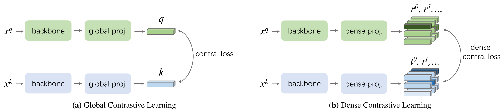

# Dense Contrastive Learning for Self-Supervised Visual Pre-Training

[toc]

- 词短句翻译

  sub-optimal：不是最好的，次佳的

  discrepancy：不符，矛盾

  contrastive：对比的

  negligible：微不足道的

  overhead：费用，支出

  paradigm：范例

  dominant：占优势的

  straightforward：直接的直观的

  notoriously：众所周知地，臭名昭著地，（贬义词）
  
  projection：投影，映射
  
  spatial：空间的
  
  correspondence：通信，对应关系
  
  tailored：定制的，裁缝做的，合身的，讲究的
  
  customized：定制的，用户化的
  
  co-occurrence：同现
  
  reconstruction：重建
  
  breakthrough：突破性的
  
  utilize：利用
  
  be formulated as：规则，用公式表示
  
  leverage：利用，影响
  
  explicit：明确的，明显的
  
  conceptual：概念上的
  
  illustration：图解，说明
  
  revisit：重游，再访问
  
  instantiate：举例说明，实例化
  
  identical：同一的，相同的

## Abstract

迄今为止，多数自监督学习方法多针对图片分类领域涉及优化。但是由于图片级别的预测和像素级别的预测的差别，这些预训练模型并不是最优的。为了弥补这一差距（To fill this gap），我们致力于设计一个有效，密集预测的自监督学习方法，根据局部特征之间的对应关系实现像素级别（局部特征）的预测工作。基于上述想法，我们提出了密集对抗学习，通过优化输入图在不同视图之间相对应像素级相似损失（不行四损失），实现了自监督学习。

相较于基准方法MoCo-v2，我们的方法虽然多出了一些微不足道的花销（only <1% slower），但是在迁移到下游任务（downstream task：包括目标检测、语义分割以及实例分割）上时保持了一贯的优秀表现，且比当前最先进的方法提升极大。特别地，与强大的MoCo-v2基线相比，我们的方法取得了显著的改进，在PASCAL VOC目标检测和语义分割，COCO的目标检测和实例分割，Cityscapes语义分割任务上都取得了一定的进步

## Introduction

在许多计算机视觉任务中，预训练已经形成一个标准的流程（a well-established paradigm）。在一个经典的预训练流程中，模型会先在大规模的数据机上进行预训练，然后在较小的训练数据上进行目标任务的精细调整。值得一提的是，受监督的ImageNet预训练多年来一直占据主导地位，它的预训练模型主要为了解决图片分类问题，同时能够迁移到其余下游任务。但是，图片分类和希望能够密集预测的任务，比如目标检测和语义分割，之间有差距。前者专注于对一张输入图片赋予一个标签，而后者需要对整张图片进行密集预测（比如：对像素进行预测）或回归。举例来说，语义分割需要对每一个像素设置标签，目标检测则是对于所有关注实例进行标签预测和物体框的检测。一个直观的解决办法是直接针对密集预测任务进行预训练。然而，这些任务的标注信息相比于图片级别的标签，生成花费过于庞大，因此难以收集到大规模的有标注的数据去进行通用的特征预训练模型。  

近段时间，无监督视觉相关预训练受到了极大研究的关注，旨在从在庞大的无标签数据集中学习到合适的特征（a proper visual representation，合适的预训练模型）。有一些方法已经证明了在下游任务上，得到了不逊色于基于ImageNet数据集监督性预训练模型效果的结果。然而，图像分类和目标密集检测任务之间的差距仍然存在。首先，几乎所有最新的自监督学习方法公式化的认为学习过程是利用全局特征进行图像级别的预测。他们都可以视为将图片分类为自己的版本，比如 instance discrimination。甚至，现存的方法经常根据图像分类的基准进行性能衡量和优化。但是，更好的图片分类并不能确保更准确的物体检测。因此直接针对密集预测任务的自监督学习就显得极为重要（意译，原文：Thus, self-supervised learning that is customized for dense prediction tasks is on demand）。对于无监督预训练，密集繁重的标注不再被需要。一个简单之间的想法是针对密集预测任务进行预训练，以此来弥补预训练和目标密集预测任务之间的差距。

受监督性密集预测任务的启发，比如本质上是密集逐像素分类的语义分割，我们提出视觉领域自监督密集对比学习预训练。DenseCL将自监督学习任务视为一个密集的成对对比学习（a dense pairwise contrastive learning）而不是一个全局的图片分类。首先，我们引入了一种密集映射头（a dense projection head）能够将主干网络的输出特征转化为密集特征向量。相比于前文提到的已有的对全局信息进行池化，输出一个单一的图像级的全局特征向量的全局映射头，我们的方法天然的保留了空间信息并构建了密集输出格式。其次，我们通过提取视图之间的对应关系来定义每个局部特征向量的正样本。我们更进一步的设计了一种密集对比损失，将常规的InfoNCE损失扩展为适用于密集的范式（we further design a dense contrastive loss, which extends the conventional InfoNCE loss to a dense paradigm）。通过上面的方法，我们在FCN的基础上进行了密集的对比学习，其过程类似于目标密集与训练任务。

我们的主要贡献总结如下（Our main contributions are thus summarized as follows）：

- 提出了一种新的对比学习范式，密集对比学习，能够进行像素级别（或是特征级别）的成对对比学习
- 使用提出的密集对比学习，我们设计了一种简单有效的自监督学习方法
- DenseGL相比于当前最先进的MoCo-v2，在将预训练转换为下游密集预测任务，譬如目标检测，实例分割和语义分割的情形上，表现比当前最优方案更好，同时元朝在ImageNet上的监督性预训练模型。

## Related Work

**self-surpervised pre-trainning**：一般而言，自监督学习的成功得利于两个重要方面：对抗学习以及训练前置任务（pretext tasks）。多数方法中训练视觉表征的目标函数，或是基于重建的损失函数，或是衡量多个视图同时出现的对比损失。对比学习能成为最先进方法的关键在于，正样本对往往由同一图片（或是其他视觉模式）的两个增广视图组成，而负样本对则有不同图片构成。

广义的pretext tasks往往用于学习一个更好的表示方式。比如：图片上色，内容自动编码器，图像修复，关系预测/上下文预测（spatial jigsaw puzzles）或是旋转（区别角度）。这些方法在计算机视觉都只实现了非常有限的效果。直到SimCLR的出现，自监督学习在pretext tasks方面才取得了突破性进展。他参考实例区分pretext task，类似于将每一实例的特征从所有训练集中的其他实例中提取。图片的不变性从简单的图片变换（比如裁剪，缩放或是图片上色）中获得（Invariances are encoded from low-level image transformations such as cropping, scaling, and color jittering）。对比学习和pretext tasks经常一起被用于构成表征学习框架。DenceCL 属于自监督学习模式，我们自然的想让这个框架对于密集预测任务（比如语义分割和物体检测）更加的友好。

**Pre-training for dense prediction tasks**：密集预测任务的预训练，在许多密集预测训练任务中，预训练能够帮助获得更好的结果（还是提及了密集训练任务有哪些，Pre-training has enabled surprising results on many dense prediction tasks, including object detection，重复提及）。这些模型多是基于ImageNet，针对图片级别识别任务的预训练模型。之前的一些研究已经表明了ImageNet预训练任务和密集预测任务在网络架构环境的差别。YOLO9000提出在结合分类数据集和检测数据集，同时训练物体检测器。其他研究证明即使我们在一个非常庞大的分类数据集上进行预训练，其预训练模型对于目标检测的提升仍然相对较小。近期的工作则表明相比于ImageNet预训练模型，使用目标检测数据和标签进行预训练，其结果能实现相当的效果。虽然密集预测任务的监督性预训练在DenseCL之前已经有大量人对其进行研究，但是对于密集预测任务的无监督方法（paradigm：范式，标准方法，流程）却很少有相关的研究工作。

**Visual correspondence**：visual correspondence problem（视觉匹配问题）主要是去极端从同一场景中获得的两张图片的对应像素组成的像素对。这一问题对于很多应用而言非常重要，包括光流法（optical flow），运动恢复结构（SFM，主要用于三维重建），视觉同步定位与建图(visual SLAM)，3D重建（3D reconstruction）等等。视觉匹配可以归结为一个问题从匹配的部分或是对应点中学习到特征的相似性（Visual correspondence could be **formulated** as the problem of learning feature similarity between **matched patches** or **points**）。近阶段，大量基于卷积神经网络的方法出现，或是采用监督性学习法，或是采用无监督性学习方法，来度量图片中对应部分的相似性。前者的工作多利用明确的监督性学习针对特定的应用去学习匹配关系。DenseCL则是学习能够在多个密集预测任务中都能够有用的通用表征。

## Method

### 3.1. Background

在自监督表征学习发展过程中，其最具突破性的工作是MoCo-v1/v2和SimCLR，两者都利用无监督对比学习从无标签数据中学习到好的表征。我们将抽象出一个概念流程进而对当前最先进的方法进行一个简短的介绍。

**Pipeline**：对于一个没有标签的数据集，会先经过一个实例区分的pretext task来将训练集中的每一张图片的特征和其他图片特征区分出来。而每一张图片会通过随机的数据增强方式（不确定这样翻译是否合适，data augmentation）获得不同的视图。不同的视图会被喂入到编码器中提取到能够编码表示整个视图的特征。编码器有两个核心，主干网络和映射头。映射头连接在主干网络上，主干网络是预训练后需要用于其他任务的模型，而映射头则是会在预训练结束被遗弃。每一对视图可以由同一编码器编码，也可以分别由一个编码器和它动量更新后的编码器编码。编码器通过对比编码器是通过优化下面描述的一个两两对比相似度（不相似度）损失训练。整体流程如下：

**Loss function**：根据Moco的思想原则，对比学习可以视为字典查找任务。对每一个编码的查询$q$，都有一系列编码的键$\left\{k_0,k_1,...\right\}$，其中一个正键$k_+$对应着一个查询$q$。编码的查询和键有不同的视图产生。对于编码查询$q$，它的正键$k_+$是对同一图像的不同视图进行编码，而负键（negative keys）则是对不同图像的视图=进行编码。对比损失函数InfoNCE如下，
$$
\mathcal{L_q}=-log\frac{exp(q{\cdot}k_+/\tau)}{exp(q{\cdot}k_+)+\sum_{k_\_}exp(q{\cdot}k_\_/\tau)}
$$
$\tau$：温度超参数

使用上述上述损失函数来让$q$更贴近$k_+$，区别于负键

### 3.2. DenseCL Pipeline

我们为密集预测任务提出了一种新的自监督学习框架————DenceCL。

他将当前存在的框架推广并概括为密集的规范流程。相较于Section 3.1中提及的规范流程，主要的区别在于编码器和损失函数。使用主干网络ResNet或者其他卷积神经网络提取输入视图的特征，然后前向传播给后续的投影头。投影头由两个并行的分支组成，分别是全局投影头和密集投影头。

全局投影头能够用现在已知的投影头来替换，他负责将密集特征图转换为全局特征向量（which takes the dense feature maps as input and generates a global feature vector for each view），举例而言，假设投影头由一个全局池化层和一个包含两个全连接层，全连接层中间有ReLU层的MLP（多层感知机）组成，而密集预测头则能够使用相同输入但输出密集特征向量。

特别的，全局池化层被移除，与此同时MLP改为同一的$1\times1$卷积层。事实上，密集预测头有和全局预测头相同数量的参数。在全局特征和局部特征层面上，主干网络和两个并行预测头，通过优化联结对对比相似（不相似）损失率（joint pairwise contrastive
(dis)similarity loss）实现端到端的训练。

### 3.3. Dense Contrastive Learning

我们在原始的对比学习损失函数基础，推广到密集规范流程。我们为每一个编码的查询定义了一系列编码键$\left\{t_0, t_1, ...\right\}$