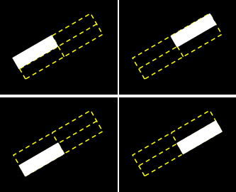

# Multi-oriented scene text detection via corner localization and region segmentation

- 词短句翻译

  state-of-the-art：最先进的

  arbitrary-orientation：任意方向

  aspect ratio：宽高比

  demonstrate：证明，论证

  validate：证实，验证

  comparable：相等的，类似的

  extract：提取，提炼

  retrieval：恢复

  textual：文本的

  occlusion：遮挡

  eliminate：消除

  pipeline：引申为流程

  spontaneously：自发地

  outperform：胜过，做的比……好

  substantial：实质性的

  deconvolution：反卷积

  two-dimensional coordinates：二维坐标

  clockwise：顺时针方向

  expediently：方便地，便捷地

  bilinear：双线的

  simultaneously：同时的

  ground truth:监督学习中，往往将正确的标注成为ground truth

  perpendicular：垂直的

- 相关一些其他类似论文方法：

	两类，

	一，预选框类型，目标检测，TextBoxes，FCRN，R2CNN，EAST

	二，基于目标分割，后处理生成文本框

## Abstract

要解决什么问题，回顾过去方法，进一步引出自己的方法，完成了什么，在数据集上表现怎么样，实现了什么样效果

## Introduction

当前在此类领域的发展情况，遇见的问题，现有的方法，我的方法与他们的差别

我们做的工作，实现的方式的流程描述，新方法的优点。

在一些数据集上，指标的展示定量的展示，

本文使用了F-Measures，在ICDAR2015、MSRA-TD500、MLT等数据集上，除了说明效果外，还有提及速率，

> It can process more than 10.4 images (512 * 512 in size) per second.

因为文中阐述，在效果和速率方面都有提升

文章的贡献，2-3条，本文中有四条，提出了什么样的新网络，网络中特殊的方法Trick，完成什么样的人物，方法的优秀性，

## Related Work

相关工作，同领域的方法

由于同领域工作分为多种方式，因此有分类

### Regression Based Text Detection Regression

检测框回归法，描述了其实现方式，展示出自己与他的不同

### Segmentation Based Text Detection

基于目标分割，通过一些先验规则或者直接通过网络（比如FCN）分别识别出文字区域，字母和文本方向，然后得到文本框

自己方法的不同，是通过分割结果判定测验框的分数合理性，筛掉不合理的存在

### Corner Point Based General Object Detection

比如角点检测层和稀疏样本层以替换Faster-RCNN样式的两阶段模型中的RPN，又比如PLN（点链接网络）

自己方法的区别：

首先，我们方法的角点检测器是不同的。其次，我们使用分割图来对候选框进行评分。第三，它可以为对象（文本）生成任意导向的框。

### Position-Sensitive Segmentation

位置敏感分割，**（比较陌生之后可关注下）**

新网络的不同：

- 我们直接利用位置敏感的实况优化网络（Sec 4.1.1); 

- 我们的位置敏感地图可用于同时预测文本区域和评分建议（Sec 4.2.2），与使用两种位置敏感地图（内部和外部）的FCIS不同
- 我们提出的轮换位置敏感ROI平均池可以处理任意导向。

## Network

construction：

网络主要为全连接网络，用于特征提取、角点检测、位置敏感分割。

### Feature Extraction

根据VGG-16进行了调整，从FPN，DSSD中获得灵感，重新设计的主干（backbond）网络，解决了以下两个问题：

- 场景文字大小长度变化大
- 自然场景的背景极度复杂

具体细节：

VGG-16的fc6和fc7（第六层全连接层和第七层全连接层）更改为卷积层，记为Conv6和Conv7，在他们的后面继续堆叠4个卷积层，分别是Conv8，Conv9，Conv10，Conv11，提高特征提取感受野。然后参考DSSD网络的中的反卷积（deconvolution），对应C3-C11设计了F3-F11，具体情形就是，F11经过反卷积在和C10进行一定的计算得到F10，F10的W，H应是与C10相同，我个人认为这样的作用可以让高层网络中一些特征更加的明显，比较官方的解释描述而言：

> 高层网络感受野比较大，语义信息表征能力强，但是分辨率低，几何细节信息表征能力弱。低层网络感受野比较小，几何细节信息表征能力强，虽然分辨率高，但语义信息表征能力弱。DSSD中的反卷积的方法就是对高层语意信息和低层细节信息进行融合。

### Corner Detection

对于一个旋转了的矩阵往往可以用以下格式描述：

$$
R=(x,y,w,h,\theta)
$$
但而对于一个矩形而言，他的四个顶点也可以确认他所处的位置，因此我们选择了一种新的描述方式，以矩形四个顶点坐标按照顺时针的方向定义矩形的存在

$$
R=\{(x_1,y_1),(x_2,y_2),(x_3, y_3),(x_4, y_4)\}
$$
此外在网络中为了能够更加便捷的检测到角点，我们将角点视为一个小型正方形$C$（Corner的缩写）：

$$
C=(x_c,y_c,ss,ss)
$$
上述描述角点的式子中，$x_c$和$y_c$就是角点的横纵坐标，也是正方形$C$的中心点坐标，而$ss$就是角点所在的矩形$R$的最短边的长，同时$ss$也作为角点自身正方形$C$的边长

在新网络中，我们将角点按照四种（左上，左下，右上，右下）类型检测，检测网络会输出对于四个类别的分类分数以及偏差量。

对于角点检测模块，我们同样是基于卷积网络，分别有两个分支分别去计算角点的分类分数以及偏差量，同时为简便计算将卷积滤波统一设为256（意思应该是将卷积核数量设置为256），那么，对于一张$m*n$的特征提取结果而言，对于每个单元（原文中是cell，就像是图片中的pixel，特征提取层的最小单位，或者也可以理解为YOLO中Grid），会有K个先验框，对于每个先验框，Score模块回给出两个分数，分别表示该位置是、否存在角点，Offset模块则会给出四个偏移量（上下左右或者是中心点的x，y偏移+框w，h偏移）。总的来说，Score模块的输出会是$w*h*(k*q*2)$，Offset的输出会是$w*h*(k*q*4)$，q往往指的就是角点的种类数，我们认为是四种角点，这里也体现了上述的与DSSD的不同的地方

>在新网络中，我们将角点按照四种（左上，左下，右上，右下）类型检测，检测网络会输出对于四个类别的分类分数以及偏差量。

训练阶段，遵循SSD中默认框和实例的匹配策略。要检测具有不同大小的场景文本，在多个图层要素上使用多个大小的默认框。表1中列出了所有默认框的比例。默认框的纵横比设置为1。（YOLOv4中也有类似的策略）

### Position-Sensitive Segmentation

通过语义分割进而推断文本框的位置，对于边界情况等的思考较为复杂，传统的方法往往需要较为复杂的后处理，受到InstanceFCN的启发，对于一个已存在的文本框$R$，利用$g*g$的网格将文本框分为$g^2$个小区域（原文为bin)，这里划分的具体细节方法还是存疑，难道是通过坐标点计算的么但感觉好像不是的，而且没感觉出这个和InstanceFCN的联系(￣▽￣)""，感觉像是在点的基础上通过语义分割，然后每个像素点进行Score map，进而判定那个像素是否属于分割图，最主要的问题，**bin区域怎么出来的？segmentation map是划分bin后做的么？这方法和InstanceFCN有什么联系？InstanceFCN每个实例有一系列的score map，他这……🙄？**

之后利用特征提取的中的f3……f11特征层，分别进行上采样，化为统一大小，然后叠加，丰富特征信息，然后通过两次$Conv1*1-BN-ReLU-Deconv2*2$ blocks（这种描述很有趣，其实描述的是有一系列操作的模块，该模块会先利用$1*1$卷积核进行卷积，再进行一次BatchNormalization，然后通过ReLU激活函数，最后再通过一次$2*2$的反卷积操作，其实通过这样的操作能够获得ROI即region of interest），不过这两次模块有部分差异，最后一个反卷积的层中，将卷积核数量设置为$g*g$个,即调整通道数为$g^2$个，而输出结果宽高应与原图片大小相同。默认情况下，我们将$g$设置为2，通过对论文的阅读，并参考RFN中的Position-sensitive score maps，这里其实意指，通过$Conv1*1-BN-ReLU-Deconv2*2$ blocks获得了ROI，然后会根据ROI和预选框生成一个矩形，每一个ROI被分为四个区域（左上左下右上右下，四种类），然后需要针对每一个备选区域（感兴趣区域，ROI，那个矩形区域）生成$g^2$（$g$为2时就是4个）的score map，每一个ROI被分为四个区域（左上左下右上右下，四种类），然后最后一次生成的block是$w*h*g*g$,而针对分割结果如下图：

上图中的第一行是一个比较好的情况，ROI是（a）中“PAUL”，就是初始的ROI，由上述的“Conv1x1-BN-ReLU-Deconv2x2 blocks”，然后对于同一个ROI有四个分割结果图，然后通过核算分割图中的像素点是否属于对应的区域（bin，左上、右上等等……），最中对分割结果进行边界回归，同时获得对于ROI的分数。

而这第二行就是一个并不好的结果，“Calvin Klein”是ROI，但是对于ROI四个区域的语义分割结果并不好，分割的结果将“Calvin”，“Klein”视为两个独立词汇，因此在合成时，（b）中的左上的白色结果只被保留下左边的那块，右边的那一块因为不属于ROI的左上bin而被舍弃，最终得分不高，所以这个ROI被摒弃。

我的理解是其中某一层是针对所有ROI，根据所有ROI左上区域（bin）的语义分割结果得出一个分数，这般理解，那么对于之后的mask也能有相对应的理解。这里可以细细品味下。

[可以看看摘录的论文中的逻辑伪代码](#RPS-ROI-Algorithm)

## Training and Inference

### Training

#### Label Generation

根据文本框，确认一个基本的矩形能够覆盖最小的文本位置，然后确认四个角点的相对位置。

确认基本矩形位置的时候，需要注意：

- 左上，左下的角点的$x$坐标需要小于右上，右下的角点x坐标
- 左下，右下的角点的$y$坐标需要小于左下，右下的角点y坐标

然后为了描述的方便，我们用以下方式描述矩形$R$
$$
R=\{P_i|i\in\{1,2,3,4\}\}
$$

$P_i=(x_i,y_i)$则是矩形的四个角点。

网络利用矩形$R$初始化角点检测以及位置敏感分割结果，

角点检测部分：将角点视为一个矩阵，以矩形$R$的最短边作为目标检测的正方形的边。

位置敏感分割：根据$R$矩形中内容生成相应的4个与矩形大小相同的掩码（包括文字区域和非文字区域）所有的像素点为黑色的，然后将原矩形分为$p^2$个区域（bin或者叫ground truth），就本文而言是四个，记为左上，左下，右上，右下区域，然后取出一个掩码对其中一个区域进行处理，譬如取出$A$掩码，该掩码与举行同等大小，然后他将左上区域的像素设置为1，形成下图：

这是其中一个用于处理左上区域的掩码的模样。

以下是所有掩码的样子：

#### Optimization

角点检测和位置敏感分割是同时训练的，损失函数如下：

$$
L=\frac{1}{N_c}L_{conf}+\frac{\lambda_1}{N_c}L_{loc}+\frac{\lambda_2}{N_s}L_{seg}
$$

$L_{conf}$和$L_{loc}$分别来自与角点分数计算分支和角点偏移量预测分支的loss（错误率），$L_{seg}$则是来自于分割模块的loss（损失率）。$N_c$代表正向默认框（即检测框中是有东西有文本）的数量，$N_s$则是分割图（segmentation maps）的像素数量。$N_c$和$N_s$用于归一化角点检测和分割的损失，$\lambda_1$和$\lambda_2$则是平衡系数，调整三者的loss均衡。默认情况下，设置这两个参数为10。

**角点检测的置信度**参考SSD方法，利用交叉熵的方式进行计算损失，
$$
L_{conf}=CrossEntrory(y_c,p_c)
$$
$y_c$是对于所有的默认的检测框的标注（通俗点就是说，对于某一个检测框，她是否有东西有文本），他的值域是$\{0,1\}$。$p_c$就代表着网络对这一检测框的预测值，此外考虑的正负样本的不平衡，我们采取了类别的均化

> the category homogenization is necessary

方法：**the online hard negative mining**

**下面一段仅仅是对hard negative mining和OHEM的简单描述，具体可以单独成为一篇学习笔记。但我还没仔细学习**

难例挖掘与非极大值抑制 NMS 一样，都是为了解决目标检测老大难问题（样本不平衡+低召回率）及其带来的副作用

- Hard Negative Mining只注意难**负例**
- OHEM 则注意**所有难例，不论正负**（Loss大的例子）

> 首先我们看看hard negative mining
>
> hard negative，即难以正确分类的负样本，也就是说在对负样本分类时候，loss比较大(label与prediction相差较大)的那些样本，也可以说是容易将负样本看成正样本的那些样本;
>
> 对于目标检测, 我们会事先标记 ground truth，然后再算法中会生成一系列 proposal，这些 proposal有跟 ground truth重合的也有没重合的，那么 IoU 超过一定阈值（通常0.5）的则认定为是正样本，以下的则是负样本, 然后扔进网络中训练。 然而，这也许会出现一个问题那就是正样本的数量远远小于负样本，这样训练出来的分类器的效果总是有限的，会出现许多 false negative, 即预测为负例的正样本
>
> 一般来说, 负样本远多于正样本, 如 99% 的负样本, 那么算法不需要训练直接输出为负例, 准确率也会有 99%, 那么正负样本不均衡时, 预测偏向于样本多的一方, 对于目标检测而言, 负例多, 所以被预测为 false negative(即预测为负例的正样本) 可能性比较大.
>
> 为了避免这样一种情况, 需要使用策略使得正负样本尽量的均衡一点, Fast RCNN 采用的是随机抽样, 使得正负样本的比例为 1:3, 为何是1:3, 而不是1:1呢? 可能是正样本太少了, 如果 1:1 的话, 一张图片处理的 ROI 就太少了, 不能充分的利用 Roi Pooling 前一层的共享计算, 训练的效率就太低了, 但是负例比例也不能太高了, 否则算法会出现上面所说的 false negative 太多的现象, 选择 1:3 这个比例是算法在性能和效率上的一个折中考虑, 同时 OHEM(online hard example mining)一文中也提到负例比例设的太大, Fast RCNN 的 mAP将有很大的下降.
>
> 此外难负样本还有个关键词是难，当IoU的值在0.499时，我们直觉认为对于网络来说，这个样本是非常容易被误判的，因此在Fast RCNN中，选择了一些IoU在$[0.1,0.5]$之间的负样本以此让网络集中训练难样本，但这有两个问题
>
> 1. 网络可能只专注于难样本，对于easy negative辨识度不强
>
> 2. 0.5的阈值只是一厢情愿，并不准确
>
> 所以这样得到的结果可能是次优的
>
> 因此
>
> CVPR2016的Oral论文：Training Region-based Object Detectors with Online Hard Example Mining将难分样本挖掘(hard example mining)机制嵌入到SGD算法中，使得
>
> Fast R-CNN在训练的过程中根据区域提议的**损失**，**自动选取合适的区域提议**作为正负例训练。训练合适阈值
>
> 参考博客：
>
> https://www.cnblogs.com/nowgood/p/Hardexamplemining.html
>
> https://zhuanlan.zhihu.com/p/78837273
>
> https://zhuanlan.zhihu.com/p/57440670
>
> https://blog.csdn.net/u013608402/article/details/51275486

**偏移量预测分支**，利用Fast-RCNN对相较于默认检测框的偏移量进行回归，利用Smooth L1 loss进行计算

> Smooth L1 loss（平滑绝对损失函数）：随着误差线性增长
>
> L2 loss（平方损失函数）：收敛速度快，但存在离群点（outliers)的时候，这些点会占loss的主要组成部分，比如说真实值为1，预测10次，有一次预测值为1000，其余次的预测值为1左右，显然loss值主要由1000主宰

- L1 loss
  $$
  \begin{equation}
  \begin{split}
  & L_1=\left|f(X) -Y\right| \\
& L_1'=\pm f'(x)
  \end{split}
  \end{equation}
  $$
  
- Smooth L1 loss
  $$
  \begin{equation}
  \begin{split}
  & Smooth\ L1=\begin{cases}{0.5x^2,\quad|x|<1}\\|x|-0.5,\quad x<-1\ or\ x>1\end{cases}
  \\
	& Smooth\ L_1'=\begin{cases}x,\quad \left|x\right|<1\\-1,\quad x<-1\\1, \quad x>1\end{cases}
	\end{split}
	\end{equation}
	$$
	
- L2 loss
  $$
  \begin{equation}
  \begin{split}
  & L_2=\left|f(x)-Y\right|^2
  \\
  & L_2'=2f'(x)(f(x)-Y)
  \end{split}
  \end{equation}
  $$
> Smooth L1 loss和L1 loss函数的区别在于，L1 loss在0点处导数不唯一，可能影响收敛。smooth L1的解决办法是在0点附近使用平方函数使得它更加平滑，此外smooth L1 loss让loss对于离群点更加鲁棒，即：相比于L2损失函数，其对离群点、异常值（outlier）不敏感，梯度变化相对更小，训练时不容易跑飞。

本文中的$L_{loc}$可以表示为:

$$
L_{loc}=SmoothL1(y_l,p_l)
$$

$y_l$是ground truth（gt，标签标记的正确答案）的各方向的偏移量(yl is the ground truth
of offset branch and pl)，

$$
y_l=(\Delta x,\Delta y,\Delta S_s,\Delta S_s)
$$

$y_l$可以通过默认检测框$B=(x_b,y_b,ss_b,ss_b)$和真实角点框$C=(x_c,y_c,ss_c,ss_c)$计算获得，计算公式如下：

$$
\begin{align}
  & \Delta x = \frac{x_b-x_c}{ss_b} \\
  & \Delta y = \frac{x_b-x_c}{ss_b} \\
  & \Delta ss = log(\frac{ss_b}{ss_c})
\end{align}
$$

$p_l$则是与之对应的模型的预测值，

$$
p_l=(\Delta \widetilde{x},\Delta \widetilde{y},\Delta \widetilde{s_s},\Delta \widetilde{s_s})
$$

**训练位置敏感分割分支**时所使用的Dice loss，如下：
$$
L_seg=1-\frac{2y_sp_s}{y_s+p_s}
$$
$y_s$是标签值，$p_s$则是预测值

### Inference

#### Sampling and Grouping

推断阶段，根据确定的位置，短边信息以及预测置信度，所有预测中选择Score大于0.5的角点检测结果，经过NMS（非极大抑制），获得了四类候选角点的相关信息。

获得角点后，由于一个矩形可以通过两个点和垂直于两点连线的一条直线确定，而对于预测出的角点，他的短边信息能够获得，因此，我们根据以下几条规则，将候选角点与对应短边组合：

- 不同类别间角点的相关关系不可违背，左上角的$x$应当小于右上的$x$值

- 斜矩形的短边必须要大于某一阈值，默认设置为5

- 两待组合点所预测出的短边$ss_1,ss2$，应当满足相差不大的要求，譬如满足如下公式：
	$$
	\frac{max(ss_1,ss_2)}{min(ss_1,ss_2)\leq1.5}
	$$
#### Scoring

当角点相互组合后，会产生很多的旋转的矩阵，根据InstanceFCN和RFCN的思想，利用位置敏感分割图对预选矩形进行评分。

这里需要进行描述下，分割在Backbone的F9-F3的基础上进行进一步处理，恢复到$w*h*g*g$的矩阵，此时该矩阵已经过“$Conv1*1- BN-ReLU-Deconv2x2$ blocks”得到ROI区域候选框。

新算法调整了位置敏感的ROI池层，并提出了旋转位置敏感的ROI平均池化层。具体来说，对于旋转的候选框，首先将候选框分成$g*g$区域。 然后我们为每个区域生成一个矩形，其最小区域覆盖。我们遍历最小矩形中的所有像素，并计算区域中所有像素的平均值。最后，通过平均$g*g$区间的平均值来获得旋转的边界框的得分。 算法1中显示了具体的过程。低分的候选框将被过滤掉。 我们默认将阈值$\tau$设置为0.6。

| **<a name="RPS-ROI-Algorithm">Algorithm 1</a>** Rotated Position-Sensitive ROI Average Pooling |
| ------------------------------------------------------------ |
| **Input:** rotated bounding box $B$，$g × g$ regular grid $G$, Segmentation maps $S$ 1: Generating Bins by spitting $B$ with $G$. 2: $M\leftarrow0, i\leftarrow0$ 3: **for** $i$ in $range(g × g)$ **do** 4:    $bin \leftarrow Bins\left[i\right], C \leftarrow 0, P\leftarrow 0,$ 5:     $R \leftarrow MiniRect(bin)$ 6:     **for** $pixel$ in $R$ **do** 7:         **if** $pixel$ in $bin$ **then** 8:             $C \leftarrow C + 1, P \leftarrow P +G\left[i\right]\left[pixel\right].value$ 9:     $M \leftarrow M + \frac{P}{C}$ 10: $score \leftarrow \frac{M}{g * g}$ |

## Experiments

在五个数据集上进行了测试：

ICDAR2015，ICDAR2013，MSRA-TD500，MLT，COCO-Text

### Datasets

主要就是对各类数据集的一个介绍，每种数据集侧重不同，

比如ICDAR2013侧重于水平文本检测，MSRA-TD500侧重于多方向文本检测。

### Implementation Details

实验的细节

- Trianing：在哪个数据集上（SynthText）进行的预训练，然后在那个数据集上进行的训练（then
	finetuned on other datasets (except COCO-Text)），使用了什么训练技巧Tricks（Adam to optimize our model with the learning rate fixed to $1e−4$），训练中一些值得提及的点（In pre-train stage, we train our model on SynthText for one epoch. During finetuning stage, the num- ber of iterations are decided by the sizes of datasets）
- Data Augmentation：使用数据一些细节，图片大小and balabala……
- Post Processing：后处理，设置的一些值，（NMS is the only post processing step of
	our method. We set the threshold of NMS to 0.3）
- 模型依据什么框架，在什么样的硬件上进行

### Detecting Oriented Text

在旋转文字方面的检测

### Detecting Horizontal Text

水平方向文字检测

### Detecting Long Oriented Text Line

对长、旋转的文字检测

### Detecting Multi-Lingual Text

多行文字检测

### Generalization Ability

泛化能力测试

### 上述几个检测写的时候可以注意点

在论文写的时候，可以放部分图片，表格，要以数据说话，可以等同为result部分

### Limitations

模型的缺陷

自我提出部分模型无伤大雅的缺陷

## Conclusion

总结下，本文专注于什么问题，解决了什么问题，解决的方案是什么样的，未来期望是什么。