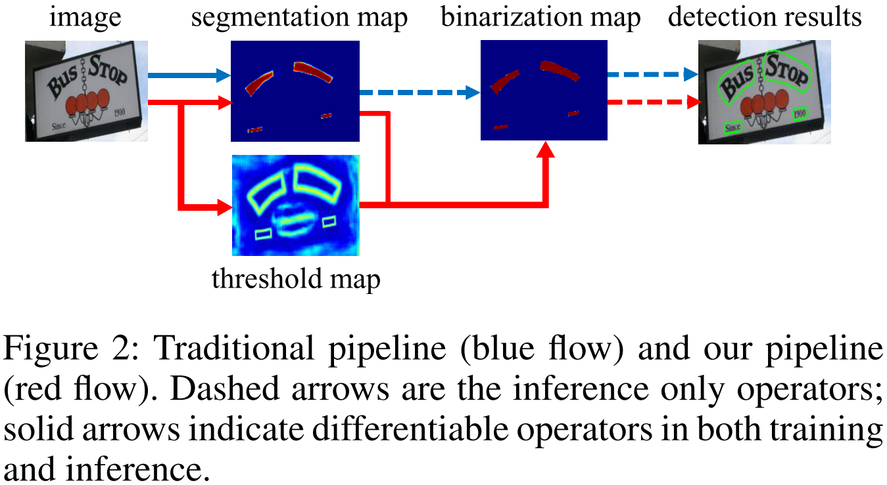
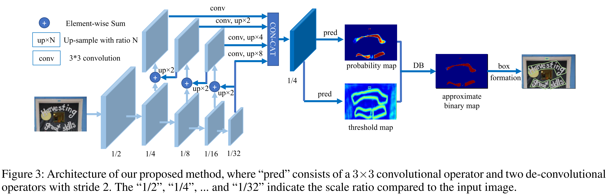
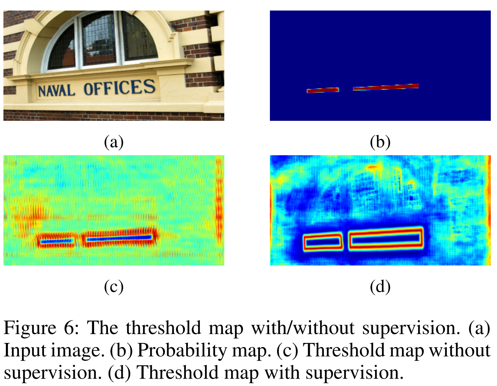
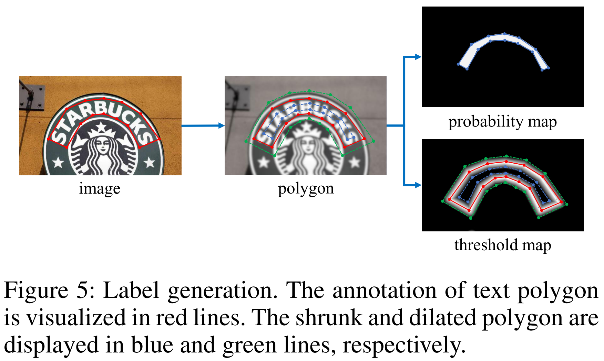

# Real-time Scene Text Detection with Differentiable Binarization

[toc]

- 词短句翻译

  differentiable：可微的，微分的

  threshold：阈值

  benchmark：基准

  in term of：在……方面

  tradeoff：权衡，折中 
  
  procedure：程序
  
  heuristic：启发式的，先验规则的
  
  consistently：一致地
  
  mechanism：机制
  
  rotation-invariant：旋转不变量
  
  decouple：解耦，分离
  
  decomposition：分解
  
  embed：嵌入
  
  cluster：聚集
  
  Methodology：方法论
  
  derivative：导数
  
  perceive：察觉，理解
  
  augmented：扩大的，增大的
  
  amplifying：放大的
  
  facilitate：促进，有助于
  
  deformable：可变形的
  
  empirically：以经验为主地
  
  dilate：使扩大
  
  formation：形成，构造
  
  perimeter：周长
  
  synthetic：人造的
  
  flip：翻转
  
  benchmark：基准

## Abstract

近年来，由于分割结果能够更加准确的刻画多形状文本譬如弯曲文本，因而基于分割的文本检测方法非常受欢迎。但是需要注意的是，二值化的后处理在基于分割的检测中非常的重要，它能够将分割网络得到的概率图转化为文本边界框或是文本区域。在本文中，我们提出了一种叫做微分二值化（DB）的方法，它能够在分割网络中发挥二值化处理的作用。通过训练时一起优化微分二值化模块，分割网络能够自适应地设置二值化的阈值，这样不仅能够简化后处理同时还能增强文本检测的能力。我们将DB模块搭载在一个简单的分割模块上并在五个基准数据集上进行了测试，在检测准确度及速率上都获得了极好的结果。值得一提的是（In particular），轻量级的主干网络结合DB模块后表现提升极大，这为我们提供了一个能兼顾检测准确度和效果的方法。特别地（Specifically），使用ResNet-18为主干网络，结合DB模块，我们在MSRA-TD500数据集上以62FPS的速率达到了82.8的F-measure。

## Introduction

近年，从场景图片中提取文字是一个具有活力的领域，它在多领域都有用武之地，如图像/视频理解，视频搜索，自动驾驶以及盲人辅助等。

作为场景文本阅读的重要组成部分，用于找到文本检测框或是文本实例区域的场景文字检测仍然是一个非常有挑战性的任务，因为场景文字往往有多样的尺寸和样子，比如水平，多方向，或是弯曲的文本。近期，基于分割的文本检测备受关注，由于它的预测结果是像素级的能够很好的刻画多样的文本。但是大多数的基于分割的方法都需要复杂的后处理将像素级的预测转化为被检测的文本实例，这导致在推理过程中需要花费大量的时间。以当前最为先进的文本检测方法为例子：

- PSENet，提出了渐进式尺度扩展的后处理方法来提高后处理的准确度
- Pixel Embedding（像素嵌入），则是需要计算像素间的特征距离，进而更鼓分割结果，对像素进行聚类操作

大多数现有的检测方法有着类似的后处理流程，如下图中的蓝色箭头：

传统流程：

1. 将分割网络的输出概率图按设定的阈值转化为二进制图片
2. 利用一些先验规则将像素聚类为文本实例

而我们的流程（上图中的红色过程），我们在第二步中将二值化操作添加到分割网络中，进行联结优化。以这种方式，图上的每一位位置的阈值可以自适应的被调整预测，进而完全区分前景和背景。但是标准的二值化方式并不可微，因此我们提出了另一种二值化近似法——微分二值化（DB），它在分割网络的训练过程中是完全可微的。

本文的主要贡献是提出了能够在CNN网络中实现可训练的端到端二值化处理。通过嘉禾语义分割的简单网络和我们提出的DB模块，我们提出了强健而快速的场景文本检测器。从使用DB模型的表现看（Observed from the performance evaluation of us- ing the DB module），我们认为我们的检测器和当前最先进的基于分割的方法相比，优点如下：

1. 我们的方法在五个场景文本基准数据集上**都**获得了很好的表现（Our method achieves **consistently** better performances on five benchmark datasets of scene text），包括水平、多方向以及弯曲文本。
2. DB模块能够提供更加具有鲁棒特性的二进制图，能大幅度简化后处理的进程，因此我们的方法比以前的主流方法更加快
3. DB模块在轻量级的主干网络中同样能够工作地很好，尤其在ResNet-18网络中极大的优化了他的检测表现
4. 由于DB模块能够在推导阶段可以移除但不用损失任何性能，因此在测试阶段，这并没有额外的开销

## Related Work

近期的场景文本检测的方法可以被粗略的划分为如下两种策略：基于回归的方法以及基于分割的方法。

**基于回归的方法**：有如下一系列直接回归文本实例的检测框的方法

- TextBoxes：在SSD的基础上对先验框和卷积核的尺寸进行了修改

- TextBoxes++和DMPNet：使用四边形回归检测多方向性的文本

- SSTD：提出了一种注意力机制粗略的区分文本区域

- PRD：就将文本分类和文本区域回归分离，分别使用旋转不变特征进行文本分类，旋转相关量进行文本区域回归，在多方向和长文本检测中获得了更好的效果

- EAST和DeepReg：是anchor-free的方法，基于像素级对多方向文本实例回归

  anchor-free和anchor-based的区别是，前者没有先验框的预设，或是keypoint-based，或是pixel-wise prediction，对于检测框进行预测，而anchor-based会是在先验框的基础上对各个不同大小的先验框进行回归调整，获得最终结果（这两者方法的区别还需要进一步学习）

- SegLink：回归分割边框，然后预测边框之间的联系，进而解决长文本的检测

- DeRPN：提出了维度分解区域提取网络（dimensiondecomposition region proposal network），去解决场景文本尺度问题

基于回归的方法往往不需要复杂的后处理算法，但是他们往往在不规则形状文本（譬如弯曲文本）检测方面有很大的局限性。

**基于分割的方法**：结合像素级的预测和后处理算法然后取得检测框

- 通过语义分割和MSER-based算法（最大稳定极值区域）检测多方向文本
- 使用文本边框区分文本实例
- Mask TextSpotter：在Mask-RCNN的基础上使用实例分割的方法检测形状多样的文本实例
- PSENet：提出了基于使用不同尺度卷积核获得的分割图的渐进式尺度扩展检测（有兴趣可以去看看）
- Pixel embedding：在分割的基础上对像素进行聚类
- PSENet和SAE：提出了一种新的后处理算法，处理分割结果，但是推导速度缓慢

而我们的方法专注于将二值化处理加入到寻来你时期优化分割结果，同时不用额外的开销，不必损失推断的速度。

**Fast scene text detection methods**：兼顾准确度和推导速度

- TextBoxes，TextBoxes++，SegLink，RPD都在SSD检测结构上实现了快速的文本检测
- EAT则是提出了使用PVANat提升自身的速度

但是他们大多数都没能解决不规则形状的文本（譬如弯曲文本）检测。与之前提及的快速的文本检测其相比，我们的方法不仅运行更加快速而且能够检测任意形状的文本内容。

## Methodology

网络结构如下：

**首先**：输入图片会被喂入到特征金字塔主干网络中

**然后**：金字塔特征会通过上采样变成相同维度，级联后得到新特征$F$

**之后**：特征$F$会被同时用于预测概率图$P$和阈值图$T$

**接下来**：利用$P$和$F$计算获得近似二进制图$\hat{B}$

**在训练期间**：通过监督学习获得概率图，阈值图和近似二进制图，概率图和近似二进制图享受同等的监督（原文“In the training period, the supervision is applied on the probability map, the threshold map, and the approximate binary map, where the probability map and the approximate binary map share the same supervision”这部分的理解还是没有很到位）

**推论阶段**：通过近似二进制图或是方框公式模块组成的概率图获得检测框

### Binarization

**Standard binarization**：分割网络得到了一个概率图$P \in R^{H \times W}$，$H$和$W$代表概率图的高和宽，进而在此基础上将概率图转化为二进制图像，二进制图像上所有值为1的像素点被视为有效文本区域。通常二值化过程可以用如下公式描述：
$$
B_{i,j} = 
\begin{cases}
1 & if \ P_{i,j} \geq t, \\ 
0 & otherwise.
\end{cases}
$$
$t$是预先定义的阈值而$(i,j)$则是`map`中对应的点坐标

**Differentiable binarization**：公式1的标准二值化过程并不是可微的，因此他无法在分割网络的训练过程中进行优化。为了解决这一问题，我们提出了一种近似法来实现二值化，公式如下：
$$
\hat{B}_{i,j} = \frac{1}{1+e^{-k(P_{i,j}-T_{i,j})}}
$$
$\hat{B}$，代表近似二进制图

$T$代表网络中学习的自适应阈值图

$k$：影响因子，经验所得设置为50

近似二值化函数与标准二值化函数行为相似，但可以微分，因此它能够在分割网络的训练过程中进行优化。可微分的二值化过程和可变的阈值不仅有助于区分文本区域和背景，同时也能将区分紧密连接的文本实例。

DB模块能够提高网络能力的原因可以用后传播的梯度进行解释。

以下将用二元交叉熵损失率的计算作为一个例子：

选择$f(x)=\frac{1}{1+e^{-kx}}$作为DB模块的函数，式子中的$x$代表上述的$P_{i,j}-T_{i,j}$

$l_+$：正标签的损失率，$l_-$：负样本的损失率
$$
\begin{equation}
\begin{split}
& l_+ = -log\frac{1}{1+e^{-kx}} \\
& l_- =-log(1-\frac{1}{1+e^{-kx}})
\end{split}
\end{equation}
$$
我们能够轻松的使用如下的链式原则计算出损失率：
$$
\begin{equation}
\begin{split}
& \frac{\partial{l_+}}{\partial{x}}=-kf(x)e^{-kx} \\
& \frac{\partial{l_-}}{\partial{x}}=kf(x) 
\end{split}
\end{equation}
$$
我们可以从微分处看到以下几点：

1. 梯度受到放大因子$k$的影响增大
2. 梯度放大对多数被错误预测的区域有显著作用，（$x<0{\ }for{\ }L_+;{\ }x>0{\ }for{\ }L_-$），因此它能够促进网络的优化，也有助于生成更加好的预测结果（produce more distinctive predictions）。
3. 如公式$x=P_{i,j}-T_{i,j}$所示，P的梯度受T影响，在前景和背景之间变化（the gradient of P is effected【原文笔误，应为affected】 and rescaled between the foreground and the background by T）

### Adaptive threshold

自适应的阈值

阈值图从表现上近似于文本边图（the text border map in (Xue, Lu, and Zhan 2018)）的效果。但是，需要认识到的是，使用阈值图和使用的文字边图的出发点和使用方法是完全不同的。阈值图只有边界处才应该是最大值，对于阈值图的gt，应该是只有边界为$1$，其余为$0$，下图分别展示了无监督学习的阈值映射图和有监督学习的阈值映射图：

如图所示，类似边框的阈值映射图对最终的结果有极大的帮助，因此我们在阈值图上使用边界监督进而更好的为之后的结果做指导。在实验介绍章节（Experiments section）将介绍有关于监督模块的消融实验。在使用方面，文本边图用于区分文本实例而我们的阈值映射图则是作为二值化的阈值依据。

### Deformable convolution

可变的卷积

可变卷积能够让模型拥有灵活的感受野，尤其对有着极端纵横比的文本内容检测有着极大的帮助。有前人将可变形卷积应用在ResNet-18或是ResNet-50主干网络的$Conv3$，$Conv4$和$Conv5$阶段的所有$3\times3$卷积层中，获得了较好的效果。

### Label generation

这一单元，标签生成，看论文似乎没有感受，但是从代码中可以看到，其实代码是在原多边形gt的基础上生成，标签然后进行加载，用于训练，并不是在训练中进行变化

受PSENet的启发，基于原gt进行标签生成。对一张文本图片，每一文本区域的多边形边界由以下一系列的分割片段进行描述：
$$
G=\left\{S_k\right\}_{k=1}^n
$$
$n$：顶点数，不同的数据集拥有不同的顶点数，ICDAR 2015数据集$n=4$，而CTW1500则为$16$

$G$：gt原文本区域

$G_S$：在$G$的基础上，根据*Vatti clipping algorithm*（mark 一下，是计算机图形学中比较经典的算法）收缩获得的被视为有效的区域，收缩的偏移量$D$，由原始文本区域边长$L$和区域$A$（"The offset D of shrinking is computed from the perimeter L and area A of the original polygon"，感觉这里说的是区域的面积）用如下公式计算获得：
$$
D=\frac{A(1-r^2)}{L}
$$
上述式子中：

$r$：收缩比，依据经验设置为$0.4$

依据上述过程，我们在$G$区域的基础上，以$D$作为偏移量扩展区域为$G_d$，$G_s$和$G_d$的间隔被认为是文本区域的边框，可以通过计算到$G$中最近的分割片段的距离来计算阈值图的标签，阈值图中最大阈值`thresh_max`，其他区域均设置为`thresh_min`。

最终概率图和阈值图的标签如下：

attention：基于$Figure{\ }5$进行描述，蓝线以内范围为$G_s$，绿线以内范围为$G_d$，二值图由阈值图和概率图通过上述公式计算获得

|                 |   蓝线以内区域    |                      绿线和蓝线中间区域                      |      其他区域       |
| :-------------: | :---------------: | :----------------------------------------------------------: | :-----------------: |
|  threshold map  | `thresh_min`(0.3) | 越靠近红线越接近`thresh_max`，越远离红线越接近`thresh_min`（1-0.3） | `thresh_min`（0.3） |
| probability map |         1         |                              0                               |          0          |
|   binary map    |         1         |                              0                               |          0          |

其实这一Section的标签都是作为对应map的gt，然后进行训练，下降Loss。

### Optimization

优化

损失函数$L$由概率图的损失值$L_s$，二值图的损失值$L_b$和阈值图的损失率$L_t$的加权和获得
$$
L=L_s+{\alpha}{\times}L_b+{\beta}{\times}L_t
$$
$L_s$：概率图的损失率

$L_b$：二值图的损失率

根据损失率的数值，实验中$\alpha$设置为$1$，${\beta}$设置为$10$。

对于$L_s$和$L_b$，我们则是使用了二值交叉熵（BCE）计算损失率，此外为了克服正负样本不平均的问题，在BCE中通过采样难负样本进行样 本挖掘。

$L_s$的损失率，没什么好说的，就是与初始标签进行比较，尽可能的使得的probability map 接近真实情况，最初通过分割后收缩获得probability 据推测应是相对较小的，然后在训练中获得更加合适的结果，而对于二值化的结果计算loss也应该是与源标签进行计算，进而调整threshold map变化的合适度，进一步控制获得结果的成果，感觉这样的获得的结果在经过扩展恢复后，获得的文本区域会相对真正结果偏大🤣
$$
L_s=L_b=\sum_{i{\in}S_i}{y_i}{logx_i}+(1-y_i)log(1-x_i)
$$
$S_l$：采样数据集，其内正负样本比为$1:3$

$L_t$：扩大后文本多边形$G_d$内各像素阈值预测值和标签的$L1$损失，这个loss感觉能够起到一定收缩扩大后的文本区域，因为阈值图是渐变过程，而原标签是断崖式的，在进行损失函数计算时，为了让损失率尽可能的小，会让阈值的界定范围缩小
$$
L_t=\sum_{i{\in}R_d}\left|y_i^*-x_i^*\right|
$$
$R_d$：$G_d$内的所有像素的索引

$y^*$：阈值图中的标签

在推导阶段，我们既可以使用概率图也可以使用近似二值图生成文本框，两者最终的结果几乎相同。出于效率考量，我们选择使用概率图并摒弃了阈值分支。

生成文本框的过程有如下三步：

1. 首先概率图/近似二进制图根据设定的阈值$0.2$生成二值图

2. 连通区域（紧缩文本区域）由二值图获得

3. 紧缩区域根据*Vatti clipping algorithm*以偏移量$D'$扩展，$D'$以如下计算方式获得
   $$
   D'=\frac{A' \times r'}{L'}
   $$
   $A'$：收缩区域的面积

   $L'$：收缩区域的周长

   $r'$：根据经验设置为$1.5$

### Experiments

#### Datasets

具体说明使用了哪些数据集，有什么特性，用于什么

**SynthText**：用于预训练，人造数据集，在自然图片中人为添加文本内容

**MLT-2017 dataset**：多语言数据集，在finetune阶段使用训练集和验证集

**ICDAR 2015 dataset**：labeled at the world level

**MSRA-TD500 dataset**：中英多语言数据集，我们在它的基础上加入了HUST-TR400的400张训练图片

**CTW1500 dataset**：专注于弯曲文本的数据集，annotated in the text-line level

**Total-Text dataset**：多形状数据集，labeled at the world level

#### Implementation details

**实现的细节**

1. 使用SynthText数据集进行预训练，进行了10万次迭代
2. 在对应的真实（非人工合成的）数据集上训练 1200 epoches，对模型进行微调，学习率的调整遵循 poly learning policy，当前迭代的学习率等于初始化学习率$r_0$乘$(1-\frac{iter}{max_iter})^{power}$，在训练过程中，$r_0 = 0.007,{\quad}power=0.9$，此外我们将权重下降率（weight decay)设置为$0.0001$，动量设置为$0.9$，$max\_iter$代表最大的迭代数，取决于最大的 epoch值。

**数据增强**

1. 图片任意旋转$(-10^{\circ},10^{\circ})$
2. 随机裁剪
3. 随即翻转

所有的图片被重新调整为$640 \times 640$，提高训练效率

**推理过程**

在推理过程中，我们保持了训练图片的宽高比，对不同数据集的输入图片设置了合适的图像高，并在$batch\_size = 1$，单 1080Ti GPU，单线程的条件下测试了推导速率。

推导时间主要分为两部分：模型前向传导以及后处理，其中后处理占总时间的$30\%$

### Ablation study

消解实验

在MSRA-TD500和CTW1500上进行了消解实验，定量地展现了我们提出的可微二值化，可变卷积以及不同的主干网络的效用 

**Differentiable binarization**：在不同数据集上上均有提升效果

**Deformable convolution**：主要贡献是提供了不同大小的感受野，而额外开销并不大

**Supervision of threshold map**：阈值图的监督性学习有所提升

**Backbone**：ResNet-50效果相较于ResNet-18有所提升但花费近两倍

### Comparisons with previous methods

和其他基准方法进行比较，在precision，recall，F-measure，FPS等参数进行比较

**Curved text detection**：在两个弯曲文本基准数据集上对我们模型的鲁棒性进行了验证，性能相较于之前的方法也有较大的提升

**Multi-oriented text detection**：在TCDAR 2015数据集上进行了验证

## Conclusion

提出了创新的网络进行检测多形状的场景文字，网络在分割网络中加入了可微分二值化模块。实验证明了，论文中提出的方法在五个标准场景基准数据集上的实验效果相较于其他方法均有进步。如果将主干网络更替为更加轻量级的ResNet-18同样能有很好的表现，而且能够有相对实时的推论速度。

再说下未来期望，

希望能实现端对端的文本识别