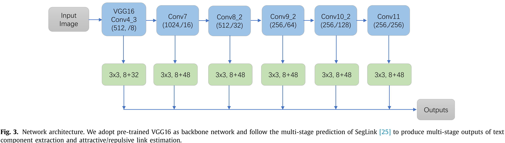

# SegLink ++ : Detecting Dense and Arbitrary-shaped Scene Text by Instance-aware Component Grouping

- 词短句翻译

	curved：弯曲的

	commodity：日常的

	aspect ratio：宽高比
	
	extract：提取
	
	granularity：粒度
	
	surpass：超出，胜过
	
	overperform：超出，胜过
	
	bottleneck：瓶颈
	
	address：设法解决
	
	explicitly：明白地，明确地
	
	repulsive：排斥的
	
	estimation：评估，估计
	
	exploit：利用
	
	facilitate：促进
	
	commodity：商品，有价值的东西
	
	aspect ratio variation：大纵横比变化
	
	centroid：形心，质心
	
	holistic：整体的
	
	utilize：利用
	
	stochastic：随机的
	
	recurrent：周期性的
	
	thorough：完全的，十分的
	
	compensates：弥补
	
	differentiable：可微的，可分辨的
	
	aforementioned：之前提及的
	
	depict：描述，描绘
	
	leverage：利用
	
	polygons：多边形
	
	sake：目的，利益
	
	alleviate：减轻缓和
	
	integrate：使完整，使成为整体

## Abstract

针对什么领域，当前这个领域里的方法已经很好了，但仍然有哪些不足？我们基于什么思想提出了

什么方法解决了什么问题？基本思想是从前就存在的，依据同一思想的方法也是有的，那么同一思想中方法的问题，你是如何解决的？在你的算法里具体是什么样的？算法的效果如何？

论文中的一些词有不同的层次，实验效果特别好：outperforms；还可以的：achieves very competitive performance，很有趣🤣。

针对文字检测，但当前方法对密集文字和弯曲文字的识别度仍然不佳，我们依据“instance- aware component grouping (ICG)”自底向上地检测密集或是任意形状的文字，此外为了解决大多数自底向上方法在分离密集文本时遇到的困难，我们提出了文本组件之间的吸引链接和排斥链接，能够更好的处理紧密文字，更好的利用上下文进行实例感知，最后在网络训练所得的吸引和排斥的基础上，依据最小生成树（MST）算法进行最后文本的检测。通过DAST1500这种针对密集性、弯曲性文字的数据集进行算法的评判，在多个数据集上的表现都比较优异。

## Introduction

场景文字检测的难点：多纵横比，大小相差大，多方向，外形多样，同时文字所处环境光影和视角的变化都比较大，传统OCR对此极难处理。

传统方法往往通过多个阶段逐步解决上述问题：

1. 通过被选择设计的特征（engineered features，这个词组的理解还没到位）提取出组合元素区域（component regions，指的应该是可能组成字串的小区域）
2. 筛选出候选组件区域
3. 组合提取出的要素通过串联等形式形成文字。

传统方法往往受限于被选择设计的特征而且需要复杂的后处理（heavy post-processing）。

深度学习在这一方向的应用，使得相关工作有了极大的发展进步。总体来说，当前基于深度学习的文字检测算法可以分为自顶向下和自底向上两类。顶-下方法主要受到一般物体检测的影响，专注解决文字检测的多方向性和大宽高比问题，它通常直接回归得到水平/转向的矩形或四边形。而底-上方法则是依据传统文字检测的思路，首先通过CNN获得组合要素然后通过要素的聚类分组组合（group）。自底向上方法更加的灵活更加能够检测出任意形状的文字。根据底-上方法中组合要素的粒度，它可以进一步被分为：像素级（pixel-level）底-上方法，零件级（part-level）底-上方法。

顶-下方法虽然已经在多方向性文字检测领域取得了重大的成果，但是他们仍然对弯曲文字和大纵横比文字感到头疼。

在弯曲文字检测方面，底-上方法远超顶-下方法（Recently, on curved text detection benchmarks, bottom- up methods **surpass** the top-down methods **by a large margin**），但由于需要繁重的后处理任务，底-上方法仍具有效率瓶颈。此外，底-下方法对于如何区分紧密文字块同样有问题。虽然在当前弯曲文字测试标准中较少出现，但他们在日常生活场景中是普遍存在的，因而需要形成一个密集多方向性文字检测的数据库并且提出一种能够很好解决相关性问题的场景文字检测方法。

论文受分水岭算法的启发（It is inspired by the mutex watershed algorithm for neuron segmentation）【旁白：这个算法没听过，可以以后单独成章，冈萨雷斯《数字图象处理》中有提到的】提出了一种**组件感知聚合方法**（instance-aware component grouping）。通过引入排斥链和吸引链，ICG能够很好辨识密集多向文字。

整体网络基于SegLink进行了再创造，吸引链和排斥链通过同一CNN feature训练得到。同时为了更好的利用文本上下文以达到区分密集文字的目的，提出了一种instance-aware损失，使得备选组合要素中不存在文字的区域有更大的损失权重（loss weight）。值得一提的是这个思想并不局限在SegLink这一方法中，所有底-上方法都可以参考这一思想。

我们根据标准PASCAL VOC的格式制作了DAST1500数据集，全部由包装纸上写有商品描述的产品图片组成，这个数据集能够使训练模型更好的专注于密集任意方向的文字。在此数据集上，ICG表现更佳。

本篇论文主要贡献在三个方面：

- 提出了ICG（Instance-aware component grouping）结构，能够结合到底-上方法中，并进一步推动这一方法在密集，多向文字检测的应用发展
- 提出了一个新的数据集
- ICG在弯曲多向文字上的检测效果更好

接下来的文章结构如下：

- 文字检测相关工作介绍（Section2）
- 提出的方法细节（Section3）
- 实验结果（Section4）
- 总结，观点（Section5）

## Related work

### Scene text detection

在深度学习介入之前，文字检测有一套经典自底向上的流程：文本模块提取筛选，文本区域组合以及对文本候选区域进行筛选。大连的工作专注于通过特定的特征提取文本组合元素（component），比如MSER（Maximally Stable Extremal Regions）和SWT（Stroke Width Transform）。近些年，深度学习在这领域广泛应用，同时在准确性和效率上也远超以往的方法。一般来说深度学习可以分为两个方向：自顶向下和自底向上两种。

顶-下方法受一般物体检测影响，基于先验框，通过回归得到文本框。在检测中，面对文本的大纵横比变化，通过SSD网络，使用长先验框和长卷积核来处理文本的大纵横比变化（applies long default boxes as well as convolution kernel to deal with large aspect ratio variation of text）。TextBoxes++在此基础上更进一步，面对多向文字通过回归多边形角点坐标进行检测。SSTD则是通过FCN引入注意力模块去增强文字检测的训练过程和多尺度的检测。面对多变的方向问题，相继产生了很多方法：

- R2CNN调整了Fast-RCNN的流程，添加了倾斜框的预测
- Deep Matching Prior Network，使用了两个分支，一个是旋转相关的特征用于检测，另一个是旋转无关的特征用于分类，进而得到更好的长的多向文本
- Instance transformation network，学习几何感知表示信息（啊，这……先看看吧，不知道，先余着）来测定文本方向

底-上场景文字检测，则是与传统方法类似的流程，首先检测出文本组件区域（text components），然后让他们串联。一般而言，底-上方法可以被分为像素级和组件级方法。

- **像素级**，将文字检测视为分割任务，因此在这方面，FCN网络经常被用于生成像素级分类特征图，然后通过后处理将文字像素组合成实例对象。
  1. 得到文本分割图，获得字符质心，然后获得文本实例
  2. 通过FCN以整体方式提取字符文字区域（mark一下，“Scene text detection via holis- tic, multi-channel prediction”）
  3. 利用FCN的多尺度输出，通过级联FCN产生文字
  4. 将文字的分割视为三类的分割，除了文字区，非文字区，还有一个边界区域。这一观念的进一步发展则是，使用语义敏感文本边界以及自展技术（bootstrapping technique）去生成更多训练实例（Bootstrapping算法，指的就是利用有限的样本资料经由多次重复抽样，重新建立起足以代表母体样本分布的新样本）
  5. Deep Direct Regression和EAST则是预测估计（estimate）基于像素的多边形
  6. PixelLink 则是使用八个方向的链接（8-direction link）识别文字边界然后组成文字实例
  7. 将图片在像素层面视为随机流图（SFG），然后使用马尔可夫聚类网络聚合成文字区域（Markov clustering Network）

- **组件级**，文字区域被视为一块块的文本组件的组合。
1. CTPN利用固定宽度的文本块进行水平文字的检测，然后通过RNN网络进行组件的链接
  2. SegLink则是通过学习分割区域以及8-邻域之间的联系，进而组合为文字实例。其作者认为可以利用四个检测得到的角点与四个部分的分割图生成文本实例（os：这不是Coner算法？下论文可以看出Corner算法的思想，“Multi-oriented scene text detection via corner localization and region segmentation”）
  3. CTD，回归得到文本内容的多个角点，然后通过TLOC提炼出结果
  4. TextSnake将文本区域视为一组Disks，实现曲线文本检测（可以想象贪吃蛇🐍）

### Comparison with related works

与传统方法相比，ICG具有类似的流程，但通过学习得到的文字组件和吸引/排斥链接极大加强了检测能力（包括准确性以及效率）。

与顶-下深度学习方法相比，ICG不但在多方向文字检测方面具有很强竞争能力，而且在多形状文本方面更加准确（the proposed ICG has the advantages to accurately detect arbitraryshaped texts while maintaining competitive results on multioriented text detection）。

ICG作为底-上方法，旨在解决一个以往的底-上方法并没有投入过多的关注的问题——密集多形状文本检测。ICG提出几个重要想法：

- 吸引/排斥链能够区分紧密的文本内容
- 定义的实例敏感损失（Instance-aware loss）能够弥补一般底-上方法后处理过于复杂难以达到端到端训练目的的问题（The proposed instance-aware loss somehow compensates the drawback of bottom-up methods which usually involve a postprocessing that cannot be trained in an end-to-end way）
- 上述方法可以被普遍的应用于密集，形状多变文本的检测

## Methodology

### 3.1. Overview

顶-下方法受一般目标检测的影响，在多向文本检测中大放异彩，但他们在自然场景中多见的弯曲文本检测方面遇到了问题。

底-上方法在任意形状文本处理中，显得更加游刃有余，也因此成为这一领域的砥柱中流。但底-下方法有如下两个主要问题：

- 难以区分距离较近的不同实例文本，对于密集文本而言，相对较近的文本区域，可能会被检测为同一文字领域
- 繁重的后处理流程难以在端到端方法中实现。底-上方法通常先检测文本组件或文本像素，然后进行组合。后处理模块不被包括在网络中，难以通过训练进行优化

为了通过底-下方法解决上述的两个主要问题——密集，多形状的文字检测，新提出一种ICG结构（instance-aware component grouping framework），网络工作流程如下：

网络通过VGG16进行特征提取，获得多层次的特征输出，在此基础上，根据文本组合元素以及各元素之间的吸引/排斥关系，通过类似最小生成树的算法（modified minimum spanning tree），组合小部分，进而得到多个多边形的文本检测框，再通过多边形NMS获得了最终结果。在这一流程中，我们利用文本实例敏感的损失函数，使得后处理的过程能够更好的与网络结合，通过训练调节后处理的效用。

ICG方法在Section 3.2中进行了详细描述（The proposed instance-aware component grouping framework
detailed in Section 3.2 is **rather general**），同时要认识到，这个思想能够被广泛的应用到各种底-上方法中。

在本论文中，我们改进了SegLink，将SSD作为主干网，新的网络结构呈现在Section 3.3。Section 3.4主要是训练的标签初始化过程；Section 3.5是网络的优化；Section 3.6则是文本推断和后处理的过程（The inference and post-processing，嘿嘿嘿这里本来不应该这么翻译，但能够感受下就行🤣！！）

### 3.2. Instance-aware component grouping framework Bottom-up

（os：第一段老生常谈，但英语描述让人觉得相对还是有新意的）

底-上文本检测通常在密集文字和任意形状场景文字检测上更加的零花，为了减轻解决分离间距过小、以及后处理难以优化的问题（To alleviate the two major problems of bottom-up text detection methods: diffi- culty in separating close text instances and non-optimized post- processing），ICG闪亮登场。

ICG由两个模块组成，分别解决上述的两个难题。

- **文本组件区域通过吸引/排斥链进行拼接**（Text component grouping with attractive and repulsive links），图片中的文本内容往往被认为是一组组具有相同几何特性邻近字符组成的序列。底-上方法处理任意形状的文本非常灵活，先提取文本组合区，然后将其组合。而后处理流程或是基于先验规则（heuristic rules，经验），或是组合规则，或是学习得到的文本区域之间的关系。我们延续了底-上方法，继承了他们的灵活性。我们利用SSD，通过卷积，根据先验框获得文本组件区域。而除了学习传统的两，组件区域之间的吸引链接外，我们也认为需要学习文本组件区域之间的排斥关系，便于区分紧密文字。同时在另一阶段也可以继续利用吸引和排斥关系解决多尺度文本检测问题。网络中吸引排斥链接定义在两个维度——横纵之间（这里感觉翻译的不准确，译为：“网络中吸引排斥链接不仅在同层相邻文本组件的之间，也存在于跨层相邻文本间”，感觉更合适，但意义不明，基本就是两行文字，不仅每行之间的文字区块有联系，上下行之间也有），最终组成了类似于边赋权图$G$，可以如下方式表示：
	$$
	G=(V,E)
	$$
	$V$是不同分辨率特征金字塔中的点的集合，$E$则是同层或跨层相邻点之间连接边的集合，每条边$e$有两个权重

	1. 吸引力（attractive force），$w_a(e)$
	2. 排斥力（repulsive force），$w_r(e)$

- **网络使用实例敏感损失函数**（Network training with instance-aware loss），以往的底-上方法难以将繁重的后处理任务结合到网络训练中进行优化。为了减轻这个问题，我们将基于最小生成树（MST算法，一般有Prim算法和Kruskal算法，基于图中文本组件区域是比较多的，边的数量也是极大的，或许使用Prim算法更加合适，此外Prim算法可以利用Fib堆进行优化。不过这里的细节。。emmm，先记录下😂）的后处理集合到网络训练中，并由此提出了ICG损失函数。此外我们还使用了IoU（intersection-over-union），将检测结果与标签刻画的实际文本区域的重合度作为一个考量网络损失的方面，如下是几个基本量：

	$g_i$：第$i$个groud-truth text instances（标记的文字实例）

	$d_i$：相对于第$i$个groud-truth text instances（标记的文字实例）的检测结果的集合

	$IoU_i^m$：$g_i$和$d_i$中每一检测结果计算IoU取得的最大值

	$d_i^m$：$d_i$中的所有检测框和$g_i$计算IoU，当取得$IoU_i^m$（当IoU为maximum）时的检测结果

	在此基础上，我们通过$\frac{1}{IoU_i^m}$来衡量基本符合$g_i$（ground-truth）回归文本组件以及组件之间吸引排斥关系。
	
	总结：
	
	ICG在大多数底-上方法中都能够使用，并能很好地分离相近文本，将后处理结合到网络训练之中。
	
	### 3.3. Network architecture
	
	新的网络结构在SegLink的基础上，借鉴SSD网络进行搭建，具体如下：
	
	
	
	

我们将VGG16作为主干网络去提取图片特征，并将最后两层全连接网络$fc_6$和$fc_7$替换为卷积层$conv_6$和$conv_7$。