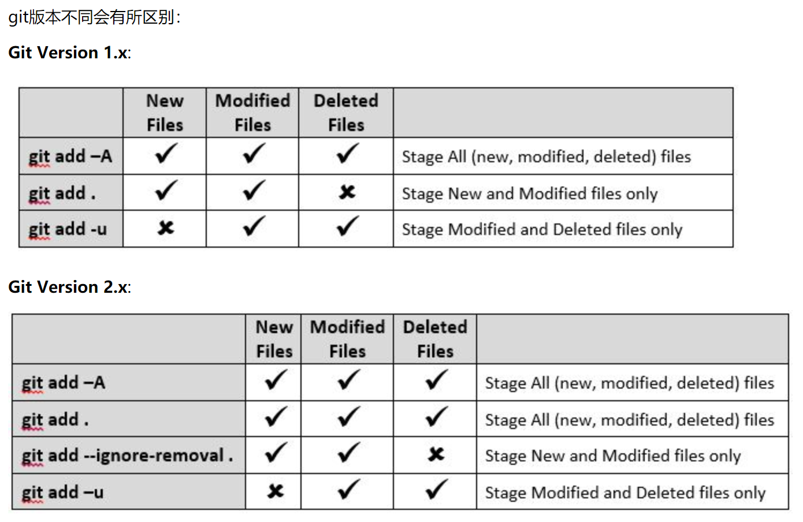

just for test

test again

提交时候的一些注意事项：

```bash
*** Please tell me who you are.

Run

  git config --global user.email "you@example.com"
  git config --global user.name "Your Name"

to set your account's default identity.
Omit --global to set the identity only in this repository.
```

本地建库后推送

```bash
# 本地库初始
git init
# 本地库添加新文件
git add 文件 或是
git add 文件夹
# 修改描述
git commit -m "想说啥都行"
# 最好尝试拉一次，如果还担心远端把本地覆盖，可以用下面的拉命令
# 这条命令会在本地合并远端的内容
git pull --rebase origin master
# 然后上传，这里我直接传到主分支了
git push -u origin master
```

一般的拉取：

```bash
# git pull origin master
```

一般的提交：

```bash
# 修改、提交前，都要先拉取。。
# git pull --rebase origin master
# 如果不知道增减了什么文件，或者新文件太多，或文件删除太多，可以用如下命令查看哪些文件未被git记录在案
git status
# 然后如果有新文件，感觉文件大概都知道，也没什么大问题，就可以用如下四个命令之一
git add "文件名"
git add . # 提交新文件(new)和被修改(modified)文件，不包括被删除(deleted)文件
git add -A # 提交所有变化
git add -u # 提交被修改(modified)和被删除(deleted)文件，不包括新文件(new)
# 修改说明
git commit -m "说明"
# 提交
git push origin master
# 可能需要你提交仓库的账号密码
# Raindow
# hezijishuohua8
```

错误情况统计：

- Changes not staged for commit
  
    提交时加上参数：-a ，表示将新增的修改添加到提交过程中（不包括Untracked files）。
  
  ```bash
  git commit -am "提交说明"
  ```

- Untracked files
  
    把文件添加进去
  
  ```bash
  git add ""文件名
  ```
  
    $git \ add$能够有多个后参数，含义不同

